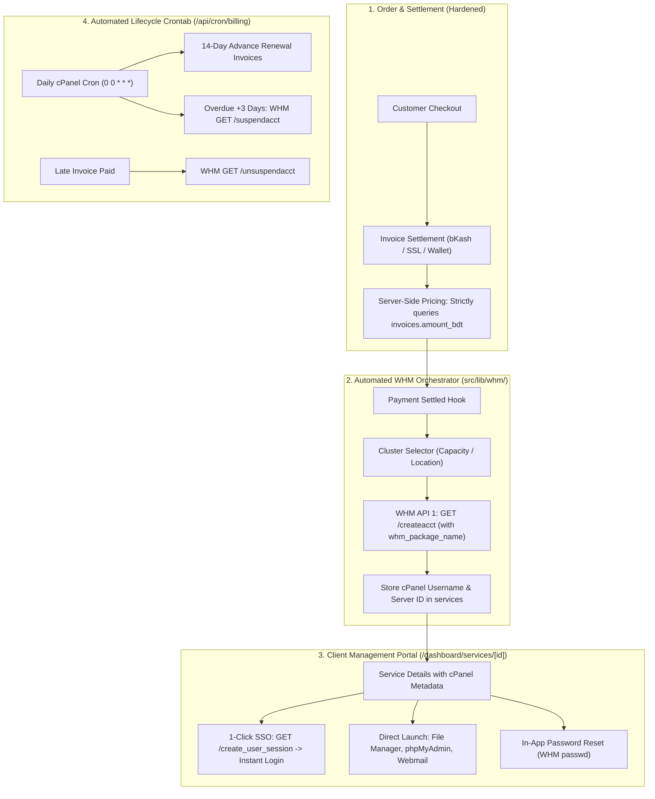

# Implementation Plan: Full-Stack Next.js 16 & MySQL Architecture with WHM Automation

## Executive Summary
This document establishes the production-grade engineering plan to refactor the **Yess Host** platform from its current **TanStack Start (Vite + Nitro + React 19) + Supabase PostgreSQL (41 tables) + 17 Deno Edge Functions** architecture into a unified, high-performance **Next.js 16 (App Router) full-stack application backed by MySQL 8.0 / MariaDB 10.4 via Drizzle ORM**.

The refactored architecture is specifically engineered to run in two deployment environments:
1. **Local Development (Immediate Priority):** XAMPP Apache + MySQL (`127.0.0.1:3306`, phpMyAdmin, local Node.js runtime).
2. **Production Hosting:** Standard **cPanel Cloud Hosting** (CloudLinux / AlmaLinux running Node.js Selector / Phusion Passenger / PM2 with `output: 'standalone'`), free of proprietary cloud vendor lock-in.

---

## Architectural Decisions & Alignment Matrix

Based on our online research, official WHM API 1 specifications ([`docs/whm-api/`](file:///home/syed/workspace/yesshost/docs/whm-api)), Next.js App Router best practices, and the `/grill-me` alignment interview, the following core decisions govern this implementation:

| Branch / Area | Selected Architectural Decision | Rationale & Implementation Details |
| :--- | :--- | :--- |
| **1. Migration Strategy** | **Staged Archive to `legacy/`** | The entire current TanStack Start app, Supabase functions, and Vite configs are moved to `legacy/`. This preserves 100% of the UI components, styles, and business logic for reference while keeping the root clean for Next.js 16 scaffolding. |
| **2. Authentication** | **Auth.js (NextAuth v5) + JWT Strategy** | JWT session cookies store `userId`, `email`, `role`, and `supportPinVerified`. Next.js Middleware (`proxy.ts` / `middleware.ts`) inspects the cryptographically signed JWT without opening edge database connections. Granular resource ownership (`WHERE user_id = ?`) is enforced at the Server Data Access Layer (DAL). |
| **3. WHM Orchestration** | **Capacity & Location-Aware Cluster Selector with Fail-Safe Queue** | Provisions accounts to active WHM server nodes based on capacity and location. If a WHM API timeout occurs, the invoice remains `paid` (no financial rollback), the service is marked `provisioning_failed`, and an automated cron retry + 1-click admin retry in the WHM console completes provisioning. |
| **4. Realtime Engine** | **Next.js Native Server-Sent Events (SSE) + Optimistic UI** | Uses Next.js Route Handlers (`/api/realtime/stream`) with standard HTTP chunked streaming. Delivers live visitor-to-agent chat, incoming call ringing, and user notifications with zero external WebSocket daemons or paid cloud services, running smoothly behind Apache/LiteSpeed proxies. |
| **5. Domain Fulfillment** | **Hybrid Registrar Adapter + Safe Queue** | Settles payment, registers the domain in `services`, and routes orders to a "Pending Registration" queue with 1-click API dispatch (Namecheap / ResellerClub) or manual confirmation for local domains (`.com.bd` / BTCL). Prevents failed checkouts due to low registrar API balances. |
| **6. cPanel SSO & UX** | **Full Quick-Launch Suite (New Tab SSO)** | Dashboard `/dashboard/services/[id]` displays a primary "Log in to cPanel" action, plus direct launch shortcuts for "File Manager" (`app=FileManager_Home`), "phpMyAdmin" (`app=Database_phpMyAdmin`), and "Webmail" (`service=webmaild`) via WHM `create_user_session` (15-min tokenized URLs). |
| **7. Database & Seeding** | **Drizzle Kit Hybrid Workflow + Standalone SQL** | Produces `drizzle/0000_init.sql` for 1-click import into XAMPP / cPanel phpMyAdmin, supports `npm run db:push` for rapid schema development, and provides `npm run db:seed` pre-populating all 42 tables and registering the active Azure WHM node (`yesshost-cpanel.eastasia.cloudapp.azure.com`). |

---

## Security & Financial Vulnerability Fixes

The new Next.js + MySQL backend systematically resolves critical vulnerabilities identified in the legacy codebase:



1. **Anti-Tampering Pricing Rule:** Payment initialization endpoints (`/api/payment/bkash/create`, `/api/payment/sslcommerz/init`) discard any client-supplied `amount` and strictly fetch `invoices.amount_bdt` from MySQL.
2. **Safe Transaction Delimiter:** SSLCommerz `tran_id` formatted as `TXN_${invoice_id}_${Date.now()}` using underscores to avoid truncating RFC 4122 hyphenated UUIDs.
3. **bKash Normalization:** Store and resolve exact invoice UUIDs across execution callbacks.
4. **ACID Wallet Deductions:** Database transactions with `SELECT ... FOR UPDATE` row locks to prevent double-spending.
5. **Idempotent Webhook Processing:** Enforce unique constraint on `(gateway, transaction_id)` in `payment_events`.
6. **Reseller Quota Nesting:** Pass `owner: reseller_whm_username` to WHM `createacct` so sub-accounts correctly attribute server-side quotas.

---

## Target Database Schema (42 Tables across 7 Modules)

All tables use `varchar(36)` UUID primary keys generated via `crypto.randomUUID()` in Drizzle defaults:

1. **IAM & Auth (7 Tables):** `users`, `accounts`, `sessions`, `verification_tokens`, `profiles`, `user_roles`, `user_permissions`.
2. **Server Infrastructure & Hosting (4 Tables):**
   - `servers`: `id`, `name`, `hostname`, `ip_address`, `whm_username`, `whm_api_token`, `location`, `max_accounts`, `active_accounts`, `is_active`, `created_at`.
   - `services`: `id`, `user_id`, `server_id`, `name`, `domain`, `cpanel_username`, `package_name`, `service_type`, `billing_cycle`, `price_bdt`, `status`, `start_date`, `expiry_date`, `suspended_at`, `suspension_reason`, `specs`, `created_at`.
   - `reseller_packages`: `id`, `user_id`, `service_id`, `package_name`, `max_accounts`, `used_accounts`, `max_disk_mb`, `used_disk_mb`, `max_bandwidth_mb`, `used_bandwidth_mb`, `whm_username`, `status`, `created_at`.
   - `reseller_accounts`: `id`, `reseller_package_id`, `reseller_user_id`, `domain`, `username`, `plan_name`, `disk_quota_mb`, `bandwidth_mb`, `cpanel_created`, `status`, `created_at`.
3. **Commerce & Billing (9 Tables):** `pricing_plans` (with `whm_package_name`), `domain_pricing`, `coupons`, `orders`, `order_items`, `invoices`, `payment_events`, `wallet_transactions`, `payment_gateway_settings`.
4. **Omnichannel Support (8 Tables):** `support_tickets`, `ticket_replies`, `live_chats`, `live_chat_messages`, `call_history`, `chat_rooms`, `chat_room_members`, `chat_room_messages`.
5. **Affiliate Engine (5 Tables):** `affiliate_profiles`, `affiliate_clicks`, `affiliate_referrals`, `affiliate_commissions`, `affiliate_payouts`.
6. **Themes Marketplace (3 Tables):** `themes`, `theme_orders`, `theme_seller_payouts`.
7. **Content & Communications (6 Tables):** `kb_categories`, `kb_articles`, `faqs`, `testimonials`, `contact_messages`, `notifications`.

---

## Phased Implementation Roadmap

### Phase 0: Staged Archiving
- Create `legacy/` folder at workspace root.
- Move existing `src/`, `supabase/`, `app/` (if any), Vite configs, and old build artifacts into `legacy/`.
- Ensure clean Git tracking without losing any historical implementation.

### Phase 1: Next.js 16 Scaffolding & Drizzle Setup
- Initialize root `package.json` with Next.js 16, React 19, TypeScript, Tailwind CSS v4, and Radix UI primitives.
- Create `next.config.ts` configured with `output: 'standalone'` and `images: { unoptimized: true }`.
- Configure `drizzle.config.ts` targeting MySQL.
- Setup `src/lib/db/index.ts` initializing a connection pool with `mysql2/promise` (`connectionLimit: 10`, `waitForConnections: true`).
- Create `.env.local` template for XAMPP:
  ```env
  DATABASE_URL="mysql://root:@127.0.0.1:3306/yesshost"
  AUTH_SECRET="super-secret-auth-key-at-least-32-chars-long"
  NEXTAUTH_URL="http://localhost:3000"
  CRON_SECRET="secure-cron-token"
  ```

### Phase 2: Drizzle Schemas & Seeding Engine
- Author all 42 tables in `src/lib/db/schema/` grouped by domain module.
- Generate `drizzle/0000_init.sql` using `drizzle-kit generate`.
- Create comprehensive seed script (`src/lib/db/seed.ts` via `npm run db:seed`):
  - Superadmin (`admin@yesshost.com` / `Admin@123456`) with hashed bcrypt password.
  - Call Center Agent (`agent@yesshost.com`) and Customer (`customer@yesshost.com`).
  - Active Azure WHM server node (`yesshost-cpanel.eastasia.cloudapp.azure.com`, IP: `20.205.120.22`, Port: 2087, Token: `yesshost-api` / `INSVHR5CGF22G438OZO5675NO30PPR8A`).
  - Hosting pricing tiers with `whm_package_name` mapping (`PH_1GB`, `PRO_5GB`, etc.), TLD rates, sample KB articles, and FAQs.

### Phase 3: Auth.js v5 Authentication & Server Data Access Layer (DAL)
- Configure Auth.js in `src/lib/auth/` with credentials provider (bcryptjs) and Drizzle MySQL adapter.
- Augment JWT session callback with `userId`, `role`, and `supportPinVerified`.
- Implement Next.js Middleware (`src/middleware.ts`) for fast edge route guarding of `/dashboard/*`, `/admin/*`, and `/call-center/*`.
- Build the Server Data Access Layer (`src/lib/dal/`) with cached session retrieval and ownership verifiers (`verifyOwnership`).

### Phase 4: Dedicated WHM Client SDK (`src/lib/whm/`)
- Pure TypeScript HTTP client using HTTPS agent targeting port 2087 with `Authorization: whm <user>:<token>`.
- Account provisioning: `createAccount({ username, domain, plan, password, owner? })`.
- 1-Click Single Sign-On: `createCpanelSession({ username, service, app? })` calling WHM `create_user_session`.
- Account lifecycle hooks: `suspendAccount()`, `unsuspendAccount()`, `terminateAccount()`, `changePassword()`, `changePackage()`.
- Server diagnostics: `checkServerHealth()` and `listAccounts()`.

### Phase 5: Payment Gateways, Crontab Billing & Domain Engine
- Payment endpoints (`/api/payment/bkash/*`, `/api/payment/sslcommerz/*`, `/api/payment/wallet/*`) with strict server-side pricing and ACID locking.
- Post-payment provisioning hook: Triggers WHM `createAccount()`, saves cPanel credentials to `services`, and sends welcome email.
- Daily Crontab Engine (`/api/cron/billing`): Generates renewal invoices 14 days ahead and suspends accounts 3 days overdue.
- SSO route handler (`/api/services/[id]/sso/route.ts`): Verifies ownership and redirects directly to cPanel / File Manager / phpMyAdmin / Webmail in a new tab.
- Native SSE endpoint (`/api/realtime/stream/route.ts`): Real-time live chat messages and operator call alerts.
- Domain registrar adapter with pending registration queue.

### Phase 6: Storefront & Auth Routes
- Port UI components from `legacy/src/components/` into `src/components/`, adapting them for Next.js App Router (`next/link`, `next/image`, Server Components).
- Storefront pages: `/`, `/about`, `/contact`, `/domain-search`, `/domain-pricing`, `/hosting-plans`, `/reseller-hosting`, `/checkout`, `/themes`, `/knowledge-base`.
- Auth pages: `/login`, `/signup`, `/forgot-password`, `/reset-password`, `/admin-login`.

### Phase 7: Client Dashboard & Reseller Studio
- Active services view (`/dashboard/services/`) with server specs and quick-launch buttons:
  - **"Log in to cPanel"** primary action
  - Shortcuts: **File Manager**, **phpMyAdmin**, **Webmail**
  - In-app password reset modal
- Invoices, Orders, Wallet Top-Up, Support Tickets, Support PIN view.
- Reseller Studio: Sub-account provisioning with quota tracking and white-label management.

### Phase 8: Admin Console & Call Center Portal
- Admin Console (`/admin/*`): WHM Server Cluster Manager (live health checks, account counts), User Management, Invoice Approvals, Payment Gateway toggles, System Logs.
- Call Center Console (`/call-center/*`): Real-time live chat via SSE, WebRTC softphone audio interface, Support PIN identity verification lookup.

### Phase 9: Verification & Production Standalone Packaging
- Full automated test suite (schema validation, seed execution, route testing).
- Standalone build verification: `npm run build` producing `.next/standalone`.
- Complete deployment guide for XAMPP (local) and cPanel Node.js Selector (production).

---

## Verification Plan

### Automated Verification
```bash
# 1. Type check & Linting
npm run typecheck
npm run lint

# 2. Database Schema Generation & Migration
npm run db:generate
npm run db:push

# 3. Database Seeding
npm run db:seed

# 4. Production Standalone Build
npm run build
```

### Manual Flow Verification
1. **XAMPP MySQL Verification:** Confirm 42 tables and seeded data exist in `yesshost` database via phpMyAdmin (`http://localhost/phpmyadmin`).
2. **Live WHM Provisioning Test:** Complete a test checkout $\rightarrow$ verify cPanel account is provisioned on the Azure WHM node within 10 seconds.
3. **1-Click SSO Test:** In `/dashboard/services/[id]`, click "Log in to cPanel", "File Manager", and "phpMyAdmin" $\rightarrow$ confirm instant authenticated login in a new tab without password prompts.
4. **Automated Cron Test:** Trigger `POST /api/cron/billing` with `Bearer CRON_SECRET` $\rightarrow$ verify 14-day renewal invoices and overdue suspensions execute.
5. **Real-Time Live Chat Test:** Send message as guest on storefront widget $\rightarrow$ verify message appears in `/call-center/live-chat` console via native SSE without page refresh.
