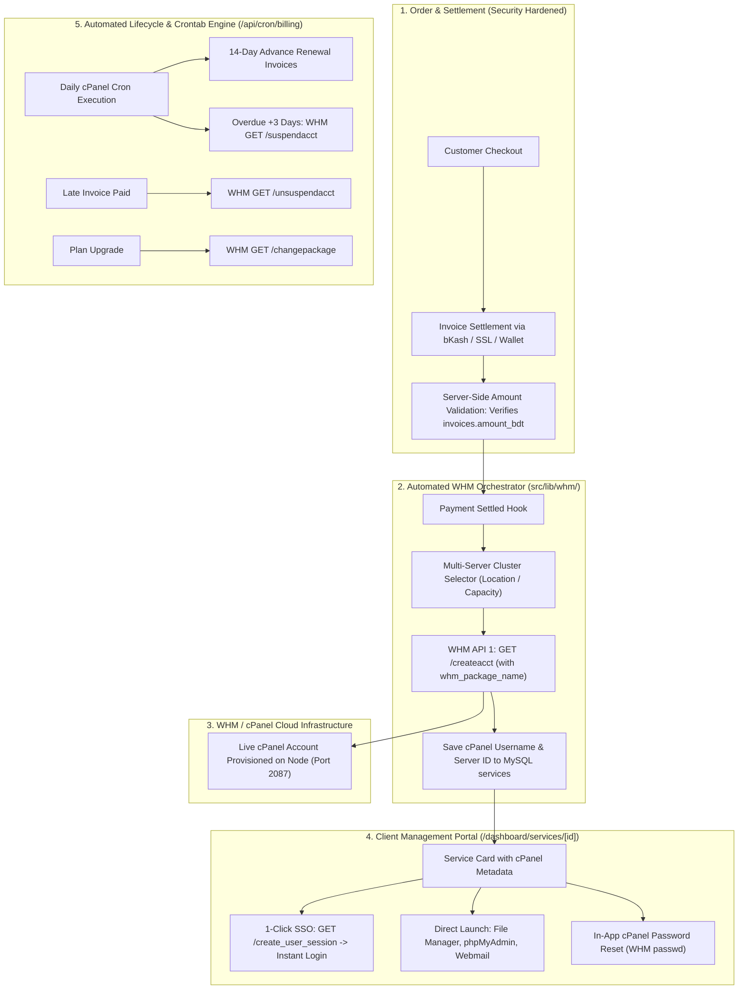
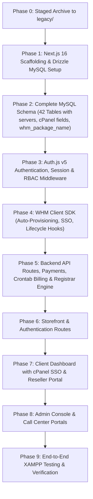

# Implementation Plan: Full-Stack Next.js (App Router) & MySQL Refactor for Local XAMPP & cPanel Hosting

## 1. Executive Overview
This document details the complete end-to-end technical plan to refactor the **Yess Host** platform from its current architecture (**TanStack Start + Vite/Nitro + Supabase PostgreSQL + Deno Edge Functions**) into a modern, unified, production-grade **Next.js (App Router, v16+) full-stack application backed by MySQL**.

The refactored architecture is specifically engineered to run seamlessly across two target environments:
1. **Local Development (Immediate Focus):** XAMPP Apache + MySQL (`127.0.0.1:3306`, phpMyAdmin, local Node.js runtime).
2. **Production Hosting:** Standard **cPanel Cloud Hosting** (cPanel MySQL / MariaDB + Node.js Selector / Phusion Passenger / PM2 reverse proxy), completely free of vendor-lock-in from proprietary cloud providers like Vercel or AWS.

---

## 2. Confirmed Architectural Decisions (from Alignment Interview)

> [!IMPORTANT]
> **Codebase Transition: Staged Migration via `legacy/` Archiving**  
> Rather than wiping the existing project in-place, the current TanStack Start app and its configurations will be cleanly archived into a `legacy/` folder. This guarantees that all existing UI components, styling, edge function algorithms, and business logic remain directly accessible as reference during the Next.js App Router scaffolding.

> [!IMPORTANT]
> **Database Engine & ORM: Drizzle ORM + mysql2**  
> Drizzle ORM with the pure JavaScript/TypeScript `mysql2/promise` connection pool. Zero native binary dependencies, runs flawlessly in cPanel CloudLinux/CageFS, and generates clean SQL schemas for XAMPP / cPanel phpMyAdmin without glibc or permission issues.

> [!IMPORTANT]
> **Primary Key Strategy: 1:1 Schema Parity (varchar(36) UUIDs)**  
> All tables will retain `varchar(36)` UUID primary and foreign keys (generated via `crypto.randomUUID()` in the application / Drizzle default). This ensures zero schema drift, preserves relational integrity, and matches Auth.js v5 user IDs seamlessly.

> [!IMPORTANT]
> **Authentication Framework: Auth.js (NextAuth v5) + Drizzle MySQL Adapter**  
> Standard Auth.js v5 integrated with `@auth/drizzle-adapter` on MySQL. Authentication uses Credentials provider (email/password with `bcryptjs` hashing) and session JWT strategy, augmenting the session token with user roles (`admin`, `moderator`, `call_center`, `reseller`, `user`) and Support PIN verification status.

> [!IMPORTANT]
> **Realtime Architecture: Next.js Native Server-Sent Events (SSE) + Optimistic UI & Polling Fallback**  
> 100% self-contained inside Next.js with zero external dependencies (no Pusher, no separate socket daemon). Live visitor chat, agent call ringing, and user notifications work out-of-the-box on XAMPP and through standard cPanel reverse proxies.

> [!IMPORTANT]
> **File & Media Storage: Local Disk Storage**  
> Themes (ZIP files), screenshots, and avatar uploads will be stored on the local filesystem (`public/uploads/`) and served statically or via streaming Next.js route handlers.

> [!IMPORTANT]
> **Replacement for Supabase PostgreSQL Row Level Security (RLS)**  
> Data isolation and authorization are enforced via a strict **Server Data Access Layer (DAL)** pattern in Next.js Server Components, Server Actions, and API Route Handlers, validating `auth()` session claims against requested resources.

---

## 3. Architecture Adjustments for cPanel & WHM Standards (`docs/whm-api`) & Security Fixes

Based on our audit of [`docs/whm-api/`](file:///home/syed/workspace/yesshost/docs/whm-api) and the existing codebase, the following critical issues and vulnerabilities have been systematically resolved:



### Comprehensive Gap, Vulnerability & Resolution Matrix

| # | Issue / Vulnerability Identified | Root Cause in Current Codebase | Official Standard / Best Practice | Resolution in Next.js + MySQL Architecture |
| :--- | :--- | :--- | :--- | :--- |
| **1** | **Client-Side Price Tampering** | `sslcommerz-init` and `bkash-init` take `amount` from request body without querying the DB. | OWASP Financial: Amounts must be fetched strictly server-side from canonical invoice records. | **Strict Server-Side Pricing:** API route handlers query `invoices.amount_bdt` from MySQL; any client-supplied `amount` is discarded. |
| **2** | **SSLCommerz UUID Splitting Truncation** | `tran_id` formatted as `TXN-${uuid}-${ts}` and split by `-`, truncating UUID to 8 chars and breaking invoice lookup. | RFC 4122: UUIDs contain hyphens and must never be split by hyphens. | **Safe Delimiter Strategy:** `tran_id` uses underscores: `TXN_${invoice_id}_${Date.now()}`, split by `_` to preserve the 36-char UUID. |
| **3** | **bKash Merchant Invoice Nullification** | Callback queries `invoices.invoice_number = merchantInvoiceNumber` when UUID was passed, plus nullified `invoiceId`. | bKash Tokenized Checkout v1.2 API spec. | **Normalized Parameter Mapping:** Store payment session context with exact invoice UUID and verify callback against canonical invoice ID. |
| **4** | **Wallet Double-Spend Race Condition** | `wallet-pay-invoice` calculated balance in-memory without database locking. | ACID Banking: Concurrent balance checks must hold row-level exclusive locks. | **ACID Transactions with Row Locks:** `db.transaction()` executing `SELECT ... FROM wallet_transactions WHERE user_id = ? FOR UPDATE`. |
| **5** | **Retail Hosting Provisioning Vacuum** | `payment-callback` only set `services.status = 'active'` in local DB without calling WHM. | WHM API 1 `createacct` (`accounts-createacct.md`). | **Automated Provisioning Hook:** `src/lib/whm/provisioner.ts` auto-calls WHM `createacct` upon payment, stores credentials, and emails client. |
| **6** | **Missing Server Cluster & cPanel Metadata** | `services` table had no `server_id`, `cpanel_username`, `package_name`, or server connection info. | WHM operations require hostname, username, and package name. | **Schema Expansion:** Added new `servers` cluster table and enriched `services` with `server_id`, `cpanel_username`, `package_name`, `suspended_at`. |
| **7** | **No Single Sign-On (SSO)** | Client dashboard had zero cPanel login links or SSO integration. | WHM API 1 `create_user_session` (`session-create_user_session.md`). | **1-Click Instant SSO:** Primary button in `/dashboard/services/[id]` generates 15-minute tokenized URLs for cPanel, File Manager, phpMyAdmin, and Webmail. |
| **8** | **Disconnected Lifecycle Hooks & Cron** | No automated suspension on overdue invoices or automated recurring invoices. | Standard hosting automation: 14-day renewal notice, 3-day overdue suspension, auto-reactivation. | **Automated Crontab Billing Engine:** `/api/cron/billing` runs via cPanel crontab, generating renewal invoices and calling `suspendacct`. |
| **9** | **Reseller Ownership Attribution Bug** | `createacct` in `whm-manage` omitted the `owner` parameter, defaulting accounts to `root`. | WHM `createacct` requires `owner=<reseller_username>` for reseller quota nesting. | Explicitly pass `owner: reseller_package.whm_username` to WHM API 1. |
| **10** | **Domain Registrar Fulfillment Gap** | Storefront sold domains, but no registrar integration existed. | Domain management requires registrar API dispatch. | **Registrar Adapter (`src/lib/domains/registrar.ts`):** Standard interface supporting registrar APIs with "Pending Admin Fulfillment" safety queue. |
| **11** | **Missing Package Mapping** | Plans had human marketing text without technical WHM package names. | WHM requires exact package names pre-created in WHM Package Manager. | `pricing_plans` schema updated with `whm_package_name` (e.g. `PH_1GB`). |

---

## 4. Architectural Transformation Matrix

| Subsystem | Current Architecture | Next.js + MySQL Architecture |
| :--- | :--- | :--- |
| **Framework & Routing** | TanStack Start (Vite + Nitro), `app/routes/*` (78 routes) | **Next.js (v16+, App Router)**, `src/app/(groups)/*` with nested layouts |
| **Database** | Supabase PostgreSQL 15+ with pg_trgm & RLS | **MySQL 8.0+ / MariaDB 10.4+** (XAMPP local & cPanel production) |
| **ORM & Driver** | PostgREST / Supabase Client JS | **Drizzle ORM** + `mysql2/promise` (connection pooling) |
| **Data Security & Auth** | Supabase Auth (`auth.users`) + SQL RLS policies | **Auth.js (NextAuth v5) + Next.js Middleware + DAL** + bcryptjs |
| **Backend & Edge Functions**| 17 Deno Edge Functions in `supabase/functions/*` | **Next.js API Route Handlers (`src/app/api/*`) & Server Actions** |
| **WHM/cPanel Integration** | Manual Deno script in `whm-manage` (reseller only) | **Unified WHM SDK (`src/lib/whm/`)**: Auto-provisioning, 1-click SSO (`create_user_session`), suspend/unsuspend, and cluster orchestrator |
| **Server Clustering** | Single key-value pair in generic config | Dedicated **`servers` table** managing multi-datacenter WHM nodes |
| **Payment Gateways** | Deno webhooks for SSLCommerz, bKash, SurjoPay | Consolidated Next.js API Routes (`/api/payment/*`) with fixed UUID, price tampering, & transaction bugs |
| **Realtime Engine** | Supabase Postgres CDC WebSockets | **Next.js Native Server-Sent Events (SSE) + Polling Fallback** |
| **Media & File Storage** | Supabase Storage buckets | Local disk storage in `public/uploads/` |
| **Deployment Target** | Cloudflare Workers / Netlify / Vercel | **cPanel Cloud Hosting** (`output: 'standalone'` via Node.js Selector) |

---

## 5. Phased Implementation Roadmap



### Phase 0: Safe Codebase Staging
1. Create `legacy/` directory and safely archive current TanStack Start app files (`src/`, `app/`, `supabase/`, Vite configuration files, etc.) so zero business logic, styling, or algorithms are lost.
2. Initialize clean root package configuration for Next.js 16 with TypeScript and React 19.

### Phase 1: Next.js 16 App Router Scaffolding & Drizzle Setup
1. Setup Next.js App Router root layout and configuration:
   - `src/app/layout.tsx` with ThemeProvider (`next-themes`) and Radix UI toaster.
   - `src/app/globals.css` with Tailwind CSS v4 and custom theme variables.
   - `next.config.ts` configured for standalone output (`output: 'standalone'`).
2. Install & configure Drizzle ORM:
   - `drizzle.config.ts` targeting MySQL.
   - `src/lib/db/index.ts` initializing connection pool with `mysql2/promise`.
   - Setup `.env.local` for XAMPP:
     ```env
     DATABASE_URL="mysql://root:@127.0.0.1:3306/yesshost"
     AUTH_SECRET="your-super-secret-key-min-32-chars-long"
     NEXTAUTH_URL="http://localhost:3000"
     CRON_SECRET="your-secure-cron-secret-token"
     ```

### Phase 2: Complete MySQL Schema with WHM & Server Cluster Tables (42 Tables)
1. Author type-safe Drizzle schema tables in `src/lib/db/schema/`:
   - **`servers.ts` (NEW):** `id`, `name`, `hostname`, `ip_address`, `whm_username`, `whm_api_token`, `location`, `max_accounts`, `active_accounts`, `is_active`, `status`.
   - **`services.ts` (ENRICHED):** `services` (enhanced with `server_id` FK, `cpanel_username`, `package_name`, `cpanel_domain`, `suspended_at`, `suspension_reason`), `reseller_packages`, `reseller_accounts`.
   - **`pricing_plans.ts` (ENRICHED):** Added `whm_package_name` (e.g. `PH_1GB`, `PRO_5GB`) to map marketing plans to WHM server packages.
   - **`auth.ts`:** Auth.js tables (`users`, `accounts`, `sessions`, `verificationTokens`) + `profiles`, `user_roles`, `user_permissions`.
   - **`billing.ts`:** `orders`, `order_items`, `invoices`, `payment_events`, `wallet_transactions`, `coupons`.
   - **`support.ts`:** `support_tickets`, `ticket_replies`, `live_chats`, `live_chat_messages`, `call_history`.
   - **`affiliate.ts`:** `affiliate_profiles`, `affiliate_referrals`, `affiliate_clicks`, `affiliate_commissions`, `affiliate_payouts`.
   - **`themes.ts`:** `themes`, `theme_orders`, `theme_seller_payouts`.
   - **`content.ts`:** `kb_categories`, `kb_articles`, `faqs`, `domain_pricing`, `testimonials`, `contact_messages`, `site_content`, `notifications`.
2. Generate initial MySQL SQL dump:
   - Run `drizzle-kit generate` to produce `drizzle/0000_init.sql` importable directly into XAMPP phpMyAdmin.
3. Build Comprehensive Seed Engine (`npm run db:seed`):
   - Superadmin account (`admin@yesshost.com` / `Admin@123456`).
   - Call Center Agent account (`agent@yesshost.com`).
   - Active Customer account (`customer@yesshost.com`).
   - **Live Azure WHM Server Node (Verified Active):** `yesshost-cpanel.eastasia.cloudapp.azure.com` (`20.205.120.22`, East Asia, root token: `yesshost-api` / `INSVHR5CGF22G438OZO5675NO30PPR8A`), enabling instant live cPanel account creation and real SSO testing from day one.
   - Hosting tiers (Shared, Cloud, Reseller, Dedicated with `whm_package_name`), Domain TLD pricing (`.com`, `.net`, `.com.bd`), sample KB articles, and FAQs.

### Phase 3: Auth.js v5 Authentication, Session & RBAC Middleware
1. Configure Auth.js (`src/lib/auth/index.ts` & `src/app/api/auth/[...nextauth]/route.ts`):
   - Drizzle adapter linking to MySQL `users`, `accounts`, `sessions`.
   - Credentials provider validating bcryptjs hashed passwords.
   - JWT session callback injecting `userId`, `email`, `role`, and `permissions`.
2. Implement Next.js Middleware (`src/middleware.ts`):
   - Route guard protecting `/dashboard/*`, `/admin/*`, and `/call-center/*`.
   - Automatic redirection to `/login` for unauthenticated requests.
   - RBAC rejection (403 or redirect) when roles do not match route requirements.
3. Data Access Layer (DAL) in `src/lib/dal/`:
   - `getCurrentUser()` — Cached session retrieval.
   - `requireAdmin()`, `requireCallCenter()`, `requireReseller()`.
   - `verifyOwnership(resource, id)` — Ensuring customers only view their own invoices/services.

### Phase 4: Dedicated WHM Client SDK (`src/lib/whm/`)
1. **Core WHM Client (`src/lib/whm/client.ts`):**
   - Pure TypeScript HTTP client targeting WHM port `2087` with HTTPS agent.
   - Support for `Authorization: whm <username>:<token>` header (`tokens.md`).
2. **Account Provisioning & Management (`src/lib/whm/accounts.ts`):**
   - `createAccount()`: Calls `GET /createacct` with domain, username, password, plan, quota, and optional reseller `owner`.
   - `suspendAccount()`: Calls `GET /suspendacct` with reason.
   - `unsuspendAccount()`: Calls `GET /unsuspendacct`.
   - `terminateAccount()`: Calls `GET /removeacct`.
   - `changePassword()`: Calls `GET /passwd`.
   - `changePackage()`: Calls `GET /changepackage`.
3. **Single Sign-On (SSO) Engine (`src/lib/whm/sso.ts`):**
   - `createCpanelSession(username, service, app?)`: Calls `GET /create_user_session` to produce 15-minute tokenized login URLs for cPanel, File Manager, phpMyAdmin, and Webmail.

### Phase 5: Backend API Routes, Payments, Crontab Billing & Registrar Engine
1. **Security-Hardened Payment Gateways (`src/app/api/payment/`):**
   - **Server-Side Pricing:** Ignore any client-supplied `amount`; fetch canonical balance strictly from `invoices.amount_bdt`.
   - **Safe Delimiters:** SSLCommerz `tran_id` formatted with underscores (`TXN_${invoice_id}_${Date.now()}`) to prevent UUID hyphen splitting.
   - **bKash Normalization:** Store and resolve exact invoice UUIDs across execution callbacks.
   - **ACID Wallet Payments:** Database transactions with `SELECT ... FOR UPDATE` row locks to prevent double spending.
   - **Post-Payment Hook:** When an invoice contains hosting services, automatically triggers `createAccount()` on the assigned WHM server node, stores `cpanel_username` and `server_id` in the `services` record, and sends customer welcome credentials via email.
2. **Automated Billing & Suspension Crontab Engine (`src/app/api/cron/billing/route.ts`):**
   - Protected by `Authorization: Bearer CRON_SECRET`.
   - Runs daily via cPanel crontab:
     - Generates recurring renewal invoices 14 days before `services.expiry_date`.
     - Automatically calls WHM `suspendacct` for accounts overdue by 3+ days.
     - Dispatches automated overdue notices via email/SMS.
3. **Domain Registrar Adapter (`src/lib/domains/registrar.ts`):**
   - Pluggable interface for registrar APIs (Namecheap/ResellerClub/BTCL) with automated "Pending Admin Dispatch" safety queue.
4. **WHM Server Management Endpoints (`src/app/api/admin/whm/`):**
   - Server cluster CRUD, connection testing (`whmCall('version')`), and capacity tracking.
5. **SSO Dispatch Route (`src/app/api/services/[id]/sso/route.ts`):**
   - Authenticated route: Validates customer ownership of service, calls `createCpanelSession()`, and redirects user straight into cPanel / File Manager / phpMyAdmin.
6. **Realtime SSE Engine (`src/app/api/realtime/`):**
   - Server-Sent Events stream for live visitor chat messages, operator call alerts, and user notifications.
7. **Communications & Utilities:**
   - SMTP Email delivery via Nodemailer.
   - SMS dispatch for Bangladesh SMS gateways.
   - Domain WHOIS availability checker.

### Phase 6: Storefront & Authentication Routes
1. Migrate components from `legacy/src/components/` into `src/components/`, adapting them for Next.js 16 (`next/link`, etc.).
2. **Storefront Pages (`src/app/(storefront)/`):**
   - Home, Shared Hosting, Cloud Hosting, Reseller Hosting, Dedicated Servers, Domains, Themes, KB, FAQs, Contact.
3. **Auth Pages (`src/app/(auth)/`):**
   - Login, Register, Forgot Password, Reset Password, Verify Email.

### Phase 7: Client Dashboard with 1-Click cPanel SSO
1. **Active Services Page (`src/app/(dashboard)/dashboard/services/`):**
   - Service cards displaying assigned cPanel username, server hostname, IP address, and disk/bandwidth stats.
   - **"Log in to cPanel" Primary Action Button** (triggers instant SSO).
   - Quick launch shortcuts: **File Manager**, **phpMyAdmin**, and **Webmail**.
   - Password reset modal invoking WHM `passwd`.
2. **Domains, Invoices, Tickets, Wallet, and Affiliate Portals.**
3. **Reseller Studio:** Allocating client accounts with explicit `owner` attribution.

### Phase 8: Admin Console & Call Center Portals
1. **Admin Portal (`src/app/(admin)/admin/`):**
   - Server Cluster Orchestrator (add/edit WHM servers, view live account loads, test tokens).
   - Global User Management, Invoices & Manual Approvals, Payment Gateway toggles, System Logs.
2. **Call Center Portal (`src/app/(call-center)/call-center/`):**
   - Live Chat console via SSE, WebRTC softphone interface, and Support PIN lookup.

---

## 6. Verification Plan

### Automated Verification
- `npm run db:generate` & `npm run db:migrate` / `npm run db:push`: Verify MySQL schemas apply cleanly without syntax errors.
- `npm run db:seed`: Verify seed script populates all 42 tables, including server nodes and test accounts.
- `npm run lint` & `npm run typecheck`: Strict ESLint and TypeScript compilation pass with zero errors.

### Manual Verification on Local XAMPP
1. **Database & phpMyAdmin:**
   - Verify `yesshost` database contains 42 tables and seed records in XAMPP phpMyAdmin.
2. **Automated WHM Provisioning Flow:**
   - Place a mock hosting order $\rightarrow$ simulate invoice payment.
   - Verify automated provisioning hook executes and populates `cpanel_username` and `server_id` on the `services` record.
3. **Single Sign-On (SSO) Flow:**
   - In `/dashboard/services/[id]`, click "Log in to cPanel".
   - Confirm call to `create_user_session` generates the tokenized login URL.
4. **Lifecycle Hooks & Cron:**
   - Trigger `/api/cron/billing` locally $\rightarrow$ verify 14-day advance invoices are created and overdue accounts receive suspension triggers.
   - Test instant unsuspension upon simulated invoice payment.
5. **Realtime Live Chat:**
   - Guest visitor sends message on storefront widget $\rightarrow$ message arrives in `/call-center` console via native SSE.
