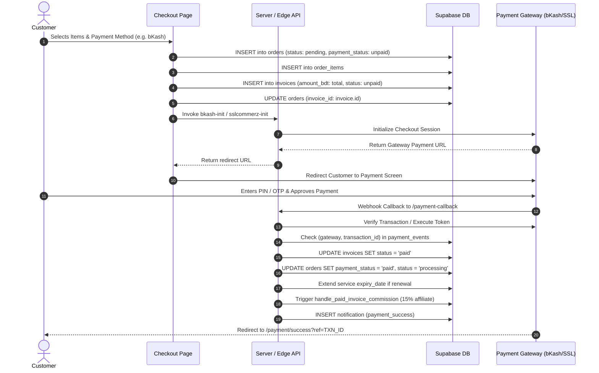
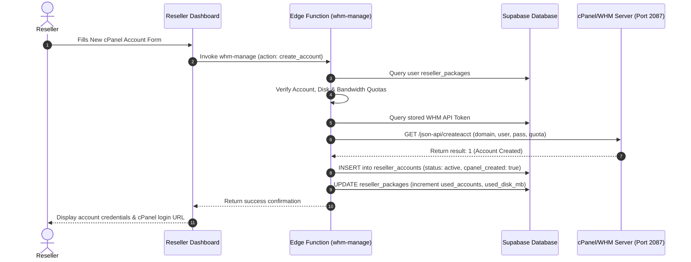

# Comprehensive Codebase Analysis, Route Documentation, ERD & Software Requirements Specification (SRS)

**Project Name:** Yess Host Web Hosting & Cloud Management Platform  
**Repository:** `yesshost`  
**Current Release:** v1.0.0 (TanStack Start Full-Stack Architecture)  
**Target Environment:** Cloudflare / Nitro / Node.js 22+, Supabase PostgreSQL 15+ (with RLS), cPanel & WHM 11.138+  

---

## 1. Executive Codebase Architecture & File-by-File Analysis

### 1.1 Architectural Overview
The application is structured as an enterprise-grade full-stack hosting and domain management application. It bridges client-side rich interactivity with server-side executions:

```
                     +---------------------------------------+
                     |           Client Browser              |
                     |  React 19 / TanStack Router / Tailwind|
                     +-------------------+-------------------+
                                         |
                       HTTP / ServerFn   |   Supabase Client (Anon/Auth)
                                         v
+----------------------------------------+----------------------------------------+
|                      Application Server (Nitro / Vite)                          |
|  - Error Capture & SSR Fallback (src/server.ts, src/start.ts)                   |
|  - Server Functions & Data Loaders (src/lib/*.server.ts)                        |
|  - RESTful API Routes (src/routes/api/*)                                        |
+-------------------+------------------------------------+------------------------+
                    |                                    |
                    v                                    v
+-------------------+--------------------+     +---------+------------------------+
|      Supabase Managed PostgreSQL       |     |        Supabase Edge Functions   |
|  - 41 Tables, 51 Applied Migrations    |     |  - Payment Inits (bKash/Nagad/SSL)|
|  - RLS Policies (User/Admin/Staff)     |     |  - Payment Callbacks & Webhooks  |
|  - Trigger Functions & Audits          |     |  - WHM / cPanel Automation       |
|  - Realtime WebSocket Subscriptions    |     |  - Domain Diagnostics & AI Chat  |
+----------------------------------------+     +----------------------------------+
```

---

### 1.2 Exhaustive File-by-File Audit

#### A. Core Application & Server Runtime
| File Path | Purpose & Responsibilities | Critical Logic & Edge Cases |
| :--- | :--- | :--- |
| `src/server.ts` | Custom server entry point wrapping TanStack Start / Nitro. | Catches h3 swallowed SSR errors (`normalizeCatastrophicSsrResponse`), consumes last captured error from `error-capture.ts`, and renders a graceful static HTML error fallback (`renderErrorPage`). |
| `src/start.ts` | TanStack Start runtime configuration. | Configures `createStart`: registers global `errorMiddleware`, `createCsrfMiddleware` (filtering `serverFn` calls), and attaches `attachSupabaseAuth` function middleware. |
| `src/router.tsx` | TanStack Router factory. | Instantiates router using `routeTree.gen.ts`, configures `defaultPreload: "intent"`, and injects TanStack `QueryClient`. |
| `vite.config.ts` | Vite & bundling orchestration. | Leverages `@lovable.dev/vite-tanstack-config` to provide Tailwind v4, TanStack router code-gen, React fast refresh, path aliases (`@/*`), and sets server entry to `src/server.ts`. |
| `tsconfig.json` | TypeScript compilation configuration. | Configured for ES2022, bundler module resolution, strict mode, paths alias (`@/*` -> `./src/*`), and `noEmit: true`. |
| `src/styles.css` | Global styling and design system. | Tailwind CSS v4 setup with `@theme inline` mapping HSL tokens, SF Pro/Inter typography, Radix UI animation keyframes, and glassmorphism card classes. |

---

#### B. Server-Side Data Loaders & Backend Libraries (`src/lib/`)
| File Path | Key Functions / Types | Description & Business Logic |
| :--- | :--- | :--- |
| `src/lib/dashboard-data.server.ts` | `loadBilling`, `loadServices`, `loadDomains`, `loadIncome`, `loadChatMessages` | Server-only data extractors. Derives authenticated Supabase client from request Bearer tokens, loads invoices, calculates wallet balance sums from completed transactions, and aggregates lifetime spend metrics. |
| `src/lib/dashboard.functions.ts` | `getDashboardBilling`, `getDashboardServices`, `getDashboardDomains`, `getDashboardIncome`, `startLiveChat`, `sendLiveChatMessage` | Exposes TanStack `createServerFn` RPC endpoints guarded by `requireSupabaseAuth` middleware for SSR and client querying. |
| `src/lib/domain-tools.server.ts` | `fetchPricing`, `priceFrom`, `submitRenewal`, `submitTransfer`, `submitDnsUpdate` | Domain operations backend. Verifies service ownership, computes renewal pricing lines with VAT and ICANN fees, and inserts unpaid renewal invoices. |
| `src/lib/payment-gateways.server.ts` | `listGatewayStatus`, `saveGateway`, `assertAdmin` | Admin-only gateway credential management. Connects via `supabaseAdmin` service role, masks secret API keys before sending to browser, and merges partial updates. |
| `src/lib/live-chat.server.ts` | `createVisitorChat`, `postVisitorMessage`, `readChatMessages`, `startCallRecord`, `updateCallRecord` | Service-role backend for support widget. Creates chat sessions, logs visitor messages, updates timestamps, and maintains WebRTC call histories. |
| `src/lib/router-compat.tsx` | `useNavigate`, `useLocation`, `useParams`, `useSearchParams`, `Link`, `Navigate` | Compatibility layer allowing React Router DOM idioms to seamlessly execute on TanStack Router without full component rewrites. |
| `src/lib/supabase-auth-attacher.ts` | `attachSupabaseAuth` | Client-side middleware that extracts active session access token from Supabase client and sets the `Authorization: Bearer <token>` header on `serverFn` invocations. |
| `src/lib/formatPrice.ts` | `formatPrice`, `formatAmount`, `toBengaliDigits` | Localized currency formatter supporting English and Bengali numeral translation (e.g., `৳১,৫০০`). |
| `src/lib/export-csv.ts` | `downloadCsv`, `csvDate` | Client-side CSV generator with automatic escaping and timestamping for billing and user reports. |

---

#### C. Supabase Edge Functions (`supabase/functions/`)
| Edge Function | Endpoints / Triggers | Detailed Functionality & Integrations |
| :--- | :--- | :--- |
| `whm-manage` | `create_account`, `suspend_account`, `unsuspend_account`, `terminate_account`, `token_status`, `save_token` | Interfaces with cPanel/WHM JSON-API v1 on port `2087`. Enforces reseller disk/bandwidth/account quotas, calls `createacct`, `suspendacct`, `unsuspendacct`, and `removeacct`, and tracks records in `reseller_accounts`. |
| `bkash-init` | POST `/functions/v1/bkash-init` | Authenticates with bKash Tokenized Checkout API (`/tokenized/checkout/token/grant`), requests payment creation (`/tokenized/checkout/create`), and returns gateway redirect URL. |
| `sslcommerz-init` | POST `/functions/v1/sslcommerz-init` | Generates hosted checkout session on SSLCommerz (`/gwprocess/v4/api.php`) with customer contact details, returns `GatewayPageURL`, and records transaction reference on invoice. |
| `nagad-init` | POST `/functions/v1/nagad-init` | Initializer for Nagad Direct Financial Service (DFS) checkout (`/check-out/initialize/...`). |
| `payment-callback` | GET/POST `/functions/v1/payment-callback` | Universal payment webhook/IPN. Performs MD5 signature verification for SSLCommerz and validator API validation; executes bKash checkout tokenized completion; settles invoices, marks linked orders as paid, automatically extends renewed domain expiration dates, logs events in `payment_events`, and sends notifications. |
| `wallet-pay-invoice` | POST `/functions/v1/wallet-pay-invoice` | Instant invoice settlement via account wallet balance. Validates user ownership, calculates current wallet credits, deducts balance via debit transaction, activates services, and issues customer notification. |
| `check-domain` | POST `/functions/v1/check-domain` | Checks domain availability across 16+ extensions (.com, .net, .org, .com.bd, .bangla, etc.), queries active pricing from `domain_pricing`, and parses RDAP WHOIS records. |
| `domain-suggest` | POST `/functions/v1/domain-suggest` | Generates 8 creative, brandable domain variations using Google Gemini 2.5 Flash Lite via Lovable AI Gateway with fallback heuristics. |
| `domain-diagnose` | POST `/functions/v1/domain-diagnose` | Resolves A, AAAA, NS, MX, TXT, and www CNAME records via DNS, verifies HTTP/HTTPS SSL connectivity, tests redirect behaviors, and outputs bilingual health scores. |
| `invoice-reminders` | Cron invocation | Scans unpaid and overdue invoices. Automatically sends reminder notifications at 7 days, 3 days, 1 day, and on due date, and automatically marks overdue invoices. |
| `chat-ai-reply` | POST `/functions/v1/chat-ai-reply` | Customer support AI assistant using Gemini 2.5 Flash. Dynamically injects real-time hosting packages and domain pricing tables into context and outputs concise bilingual support. |
| `communication-test` | POST `/functions/v1/communication-test` | Admin diagnostic runner. Validates SMTP and Email API delivery, tests SMS gateways, and executes complete OTP generation, delivery, and verification loops. |
| `admin-create-user` | POST `/functions/v1/admin-create-user` | Privileged user creation using `supabase.auth.admin.createUser`. Validates unique phone numbers in profiles and assigns initial roles (`admin`, `call_center`, `reseller`). |
| `affiliate-track` | Actions: `click`, `claim` | Tracks referral link clicks with source page attribution and binds newly registered accounts to referrers in `affiliate_referrals` and `profiles.referred_by`. |
| `send-otp` | POST `/functions/v1/send-otp` | Generates 4-8 digit numeric verification codes, applies 15-minute rate-limiting, hashes codes with salt in `otp_codes`, and sends via active Email/SMS transport. |
| `verify-otp` | POST `/functions/v1/verify-otp` | Verifies submitted codes against hashed DB records, enforces expiration and 5-attempt brute-force lockouts, and records `used_at` timestamp. |

---

## 2. Complete Route Directory & Feature Catalog

This directory catalogs all **78 routes** defined in the application route tree:

```
src/routes/
├── __root.tsx
├── index.tsx
├── about.tsx
├── contact.tsx
├── domain-pricing.tsx
├── domain-search.tsx
├── hosting-plans.tsx
├── reseller-hosting.tsx
├── checkout.tsx
├── chat-rooms.tsx
├── affiliate.tsx
├── privacy.tsx
├── terms.tsx
├── refund.tsx
├── login.tsx
├── signup.tsx
├── admin-login.tsx
├── forgot-password.tsx
├── reset-password.tsx
├── services/
│   └── $slug.tsx
├── themes/
│   ├── index.tsx
│   ├── $slug/
│   │   ├── index.tsx
│   │   └── demo.tsx
├── knowledge-base/
│   ├── index.tsx
│   └── $slug.tsx
├── payment/
│   ├── index.tsx
│   ├── success.tsx
│   ├── fail.tsx
│   └── cancel.tsx
├── dashboard/
│   ├── route.tsx (Layout & Auth Guard)
│   ├── index.tsx
│   ├── services.tsx
│   ├── domains.tsx
│   ├── domain-tools.tsx
│   ├── billing.tsx
│   ├── wallet.tsx
│   ├── orders.tsx
│   ├── order-service.tsx
│   ├── support.tsx
│   ├── support-pin.tsx
│   ├── troubleshoot.tsx
│   ├── reseller.tsx
│   ├── affiliate.tsx
│   ├── theme-seller.tsx
│   ├── income.tsx
│   ├── server-status.tsx
│   ├── knowledge-base.tsx
│   └── profile.tsx
├── call-center/
│   ├── route.tsx (Layout & Role Guard)
│   ├── index.tsx
│   ├── live-chat.tsx
│   ├── call-history.tsx
│   ├── orders.tsx
│   └── tickets.tsx
├── admin/
│   ├── route.tsx (Layout & Role Guard)
│   ├── index.tsx
│   ├── users.tsx
│   ├── services.tsx
│   ├── billing.tsx
│   ├── finance.tsx
│   ├── payment-gateways.tsx
│   ├── whm.tsx
│   ├── communication-config.tsx
│   ├── tickets.tsx
│   ├── live-chat.tsx
│   ├── chat-rooms.tsx
│   ├── call-history.tsx
│   ├── themes.tsx
│   ├── coupons.tsx
│   ├── affiliates.tsx
│   ├── cms.tsx
│   ├── marketing.tsx
│   ├── knowledge-base.tsx
│   ├── contact-messages.tsx
│   ├── analytics.tsx
│   └── staff.tsx
└── api/
    ├── public/
    │   ├── health.ts
    │   └── live-chat-messages.ts
    └── dashboard/
        ├── billing.ts
        ├── domains.ts
        ├── services.ts
        └── income.ts
```

---

### 2.1 Public & Storefront Routes

#### 1. `/` (Landing Page)
- **File:** `src/routes/index.tsx` -> `src/pages/Index.tsx`
- **Features Implemented:**
  - Hero banner with headline, call-to-action buttons, and trust metrics.
  - Live interactive domain search bar with instant availability checking.
  - Hosting product showcase: Shared, Turbo NVMe, VPS, Cloud, and Reseller hosting cards.
  - Corporate slider displaying high-availability data center facilities.
  - Features grid: 99.99% uptime guarantee, free SSL, cPanel control, DDoS defense.
  - Customer testimonial carousel with star ratings and client reviews.
  - FAQ accordion covering technical specifications, migration, and billing.
  - Language toggle (Bengali/English) and currency formatting in BDT.

#### 2. `/about` (Company Information)
- **File:** `src/routes/about.tsx` -> `src/pages/company/About.tsx`
- **Features Implemented:**
  - Corporate background, mission statement, and founding timeline.
  - Data center infrastructure specifications (Bangladesh BDIX, USA, Singapore).
  - Leadership and technical operations team profiles.

#### 3. `/contact` (Support & Inquiries)
- **File:** `src/routes/contact.tsx` -> `src/pages/company/Contact.tsx`
- **Features Implemented:**
  - Contact submission form inserting into `contact_messages`.
  - Corporate address, 24/7 hotline numbers, WhatsApp direct link, and Google Maps embed.
  - Department routing selectors (Sales, Technical, Billing).

#### 4. `/domain-search` (Domain Registration Portal)
- **File:** `src/routes/domain-search.tsx` -> `src/pages/DomainSearchPage.tsx`
- **Features Implemented:**
  - Real-time multi-TLD availability checker calling `check-domain` edge function.
  - AI Domain Name Generator calling `domain-suggest` for creative name recommendations.
  - WHOIS lookup drawer parsing registrar, creation date, expiry date, and nameservers.
  - Single-click "Add to Cart" with immediate cart drawer slide-out.

#### 5. `/domain-pricing` (TLD Rate Table)
- **File:** `src/routes/domain-pricing.tsx` -> `src/pages/DomainPricing.tsx`
- **Features Implemented:**
  - Complete pricing matrix for 26+ extensions loaded dynamically from `domain_pricing`.
  - Side-by-side columns for Registration BDT, Renewal BDT, and Transfer BDT.
  - Search/filter by popular, generic, country-code, and specialized TLDs.

#### 6. `/hosting-plans` (Web & Cloud Hosting Catalog)
- **File:** `src/routes/hosting-plans.tsx` -> `src/pages/HostingPlans.tsx`
- **Features Implemented:**
  - Categorized hosting tabs: Starter, Standard, Professional, Corporate, and BDIX Hosting.
  - Billing cycle selector: Monthly, Quarterly, Semi-Annually, Annually (with discount percentages).
  - Comprehensive feature comparison matrix: NVMe storage, RAM, vCPU, Inodes, Bandwidth.
  - One-click checkout integration linking selected package into cart state.

#### 7. `/reseller-hosting` (Reseller Packages)
- **File:** `src/routes/reseller-hosting.tsx` -> `src/pages/ResellerHosting.tsx`
- **Features Implemented:**
  - Reseller tier presentation: Bronze, Silver, Gold, Platinum.
  - Quota breakdowns: cPanel account limits, disk space allocations, white-label nameservers.
  - Free WHM root features, automated provisioning details, and overselling enable toggles.

#### 8. `/services/$slug` (Individual Service Landing)
- **File:** `src/routes/services/$slug.tsx` -> `src/pages/services/ServiceDetail.tsx`
- **Features Implemented:**
  - Dynamic route rendering specialized pages for `basic-hosting`, `turbo-hosting`, `cloud-hosting`, `usa-vps`, `bd-vps`, `dedicated-server`, `ssl`, `email`, and `domain`.
  - SEO-optimized metadata, breadcrumb structured data, and tailored specs list.

#### 9. `/themes/` & `/themes/$slug` (Theme Storefront & Details)
- **Files:** `src/routes/themes/index.tsx`, `src/routes/themes/$slug/index.tsx`
- **Features Implemented:**
  - Digital marketplace for WordPress, HTML5, and eCommerce templates.
  - Filtering by category (Corporate, Agency, Portfolio, eCommerce, Blog, Education).
  - Screenshots preview carousel, responsive preview switcher (Desktop/Tablet/Mobile).
  - Optional "Include Hosting" bundle add-on during purchase.

#### 10. `/themes/$slug/demo` (Live Theme Interactive Preview)
- **File:** `src/routes/themes/$slug/demo.tsx`
- **Features Implemented:**
  - Full-screen iframe container executing live theme demonstration.
  - Top navigation bar with viewport switcher and direct "Buy Now" button.

#### 11. `/checkout` (Shopping Cart & Order Processing)
- **File:** `src/routes/checkout.tsx` -> `src/pages/Checkout.tsx`
- **Features Implemented:**
  - Cart item list with item removal, type badges, and itemized subtotal.
  - Real-time coupon validator calling `coupons` table and RPC `increment_coupon_usage`.
  - Order note input field.
  - Payment method selector: Wallet Balance, SSLCommerz, bKash, Nagad, Bank Transfer.
  - Multi-step checkout pipeline: creates `orders` record, inserts `order_items`, generates `invoices` row, links invoice to order, and routes to respective gateway.

#### 12. `/affiliate` (Public Affiliate Marketing Program)
- **File:** `src/routes/affiliate.tsx` -> `src/pages/company/AffiliateProgram.tsx`
- **Features Implemented:**
  - 15% recurring commission program details, cookie lifetime (90 days), and payout terms.
  - Direct sign-up button creating affiliate profile upon account creation.

#### 13. `/chat-rooms` (Community Live Discussion)
- **File:** `src/routes/chat-rooms.tsx` -> `src/pages/ChatRooms.tsx`
- **Features Implemented:**
  - Topic-based public discussion rooms (General, WordPress, Web Development, Hosting).
  - Real-time chat messaging using Supabase Realtime channel subscriptions.
  - Active participant counts and online indicator dots.

#### 14. `/knowledge-base/` & `/knowledge-base/$slug` (Self-Service Docs)
- **Files:** `src/routes/knowledge-base/index.tsx`, `src/routes/knowledge-base/$slug.tsx`
- **Features Implemented:**
  - Hierarchical documentation organized by `kb_categories`.
  - Search input filtering article titles and full-text content.
  - Markdown rendered article bodies with syntax-highlighted code blocks, copy-to-clipboard buttons, and helpfulness voting.

#### 15. `/privacy`, `/terms`, `/refund` (Legal Pages)
- **Files:** `src/routes/privacy.tsx`, `src/routes/terms.tsx`, `src/routes/refund.tsx`
- **Features Implemented:**
  - Dynamic legal terms rendered via `DynamicLegalPage.tsx`.
  - Synchronized with `site_content` table allowing admin edits without code deployments.

---

### 2.2 Authentication & Verification Routes

#### 16. `/login` (Customer Authentication)
- **File:** `src/routes/login.tsx` -> `src/pages/Login.tsx`
- **Features Implemented:**
  - Email and password sign-in via `supabase.auth.signInWithPassword`.
  - Password visibility toggle and password strength feedback.
  - Automatic post-login referral code attribution via `affiliate-track` edge function.
  - Redirect handling to intended destination route.

#### 17. `/signup` (Customer Registration)
- **File:** `src/routes/signup.tsx` -> `src/pages/Signup.tsx`
- **Features Implemented:**
  - Registration fields: Full Name, Email, Phone Number, and Password.
  - Duplicate phone check before submission.
  - Database trigger `on_auth_user_created` automatically generates customer profile in `profiles` and assigns `'user'` role in `user_roles`.

#### 18. `/admin-login` (Privileged Staff Authentication)
- **File:** `src/routes/admin-login.tsx` -> `src/pages/AdminLogin.tsx`
- **Features Implemented:**
  - Specialized high-security portal for administrators and call-center operators.
  - After credential check, executes `supabase.rpc("has_role")` for `admin` and `call_center`.
  - Routes admins to `/admin` and call center staff to `/call-center`. Unprivileged users are automatically signed out with access denied alerts.

#### 19. `/forgot-password` & `/reset-password` (Credential Recovery)
- **Files:** `src/routes/forgot-password.tsx`, `src/routes/reset-password.tsx`
- **Features Implemented:**
  - Password reset email trigger using Supabase Auth.
  - Secure recovery token listener updating password credentials via `supabase.auth.updateUser`.

---

### 2.3 Payment Gateway Redirect Routes

#### 20. `/payment/` (Payment Gateway Portal)
- **File:** `src/routes/payment/index.tsx` -> `src/pages/PaymentMethods.tsx`
- **Features Implemented:**
  - Overview of supported payment channels in Bangladesh: Cards (Visa/Mastercard), MFS (bKash/Nagad), Internet Banking, and Offline Bank Wire.
  - Merchant account details, bank routing numbers, and bKash merchant numbers.

#### 21. `/payment/success`
- **File:** `src/routes/payment/success.tsx` -> `src/pages/PaymentResult.tsx`
- **Features Implemented:**
  - Displays green confirmation badge, transaction reference number (`ref` query param).
  - Quick action buttons to view paid invoice in dashboard or proceed to service management.

#### 22. `/payment/fail` & `/payment/cancel`
- **Files:** `src/routes/payment/fail.tsx`, `src/routes/payment/cancel.tsx`
- **Features Implemented:**
  - Displays failure or cancellation reason received from gateway callback.
  - "Retry Payment" button returning customer directly to invoice payment options.

---

### 2.4 Client Dashboard Routes (`/dashboard/*`)

#### 23. `/dashboard/` (Client Hub & Overview)
- **File:** `src/routes/dashboard/index.tsx` -> `src/pages/dashboard/Overview.tsx`
- **Features Implemented:**
  - KPI widgets: Active Services, Total Domains, Unpaid Invoices, Available Wallet Balance, Open Tickets.
  - Actionable alerts: Expiring domains (within 30 days), overdue invoice banners with direct "Pay Now".
  - Quick domain search shortcut directly inside dashboard.
  - Recent activity feed and latest announcements from management.

#### 24. `/dashboard/services` (Active Services Manager)
- **File:** `src/routes/dashboard/services.tsx` -> `src/pages/dashboard/Services.tsx`
- **Features Implemented:**
  - Tabular and card view of purchased hosting, VPS, and email packages.
  - Service metrics: assigned server IP address, billing cycle (monthly/annual), renewal date.
  - Expandable detail drawer showing hardware allocations: CPU cores, RAM, disk usage, and nameservers.
  - Filter pills: All, Active, Pending, Suspended, Expired.

#### 25. `/dashboard/domains` (Registered Domain Portfolio)
- **File:** `src/routes/dashboard/domains.tsx` -> `src/pages/dashboard/Domains.tsx`
- **Features Implemented:**
  - List of registered domains with status badges and registrar expiry indicators.
  - Expiry countdown badges (highlighted in yellow/red when < 30 days).
  - Quick action to open DNS Manager or initiate domain renewal.

#### 26. `/dashboard/domain-tools` (DNS & Lifecycle Toolkit)
- **File:** `src/routes/dashboard/domain-tools.tsx` -> `src/pages/dashboard/DomainTools.tsx`
- **Features Implemented:**
  - **DNS Zone Editor:** View, add, edit, and delete A, AAAA, CNAME, MX, and TXT records.
  - **Nameserver Management:** Switch between Default Yess Host Nameservers and Custom External Nameservers.
  - **Multi-Year Renewal Wizard:** Select multiple domains, choose renewal terms (1-5 years), view instant price breakdown with ICANN fees, and generate renewal invoices.
  - **Domain Transfer In:** Submit transfer authorization EPP codes and create transfer support tickets.
  - **EPP / Auth Code Extractor:** Generate transfer authorization codes for outgoing domain migration.

#### 27. `/dashboard/billing` (Invoices & Financial Records)
- **File:** `src/routes/dashboard/billing.tsx` -> `src/pages/dashboard/Billing.tsx`
- **Features Implemented:**
  - Complete invoice history: Invoice Number, Creation Date, Due Date, Total BDT, Payment Method, Status.
  - Interactive Invoice Modal: View itemized digital receipt with print and PDF download.
  - In-browser PDF generation via `jsPDF` and `html2canvas`.
  - Date-range filtering and CSV export.
  - Monthly spending bar chart visualization via Recharts.

#### 28. `/dashboard/wallet` (Prepaid Credit Balance)
- **File:** `src/routes/dashboard/wallet.tsx` -> `src/pages/dashboard/Wallet.tsx`
- **Features Implemented:**
  - Current real-time wallet balance indicator.
  - Deposit funds modal: Enter custom amount and pay via bKash, Nagad, or SSLCommerz.
  - Transaction ledger: Credits (deposits, refunds), Debits (invoice settlements), Transaction IDs, and Timestamps.

#### 29. `/dashboard/orders` (Order History & Fulfillment Status)
- **File:** `src/routes/dashboard/orders.tsx` -> `src/pages/dashboard/Orders.tsx`
- **Features Implemented:**
  - Comprehensive list of orders placed through checkout.
  - Status pipeline: `pending` -> `confirmed` -> `processing` -> `completed` -> `cancelled`.
  - Itemized drawer displaying linked domains, hosting categories, and applied discount coupons.

#### 30. `/dashboard/order-service` (Internal Ordering Wizard)
- **File:** `src/routes/dashboard/order-service.tsx` -> `src/pages/dashboard/OrderService.tsx`
- **Features Implemented:**
  - Streamlined catalog allowing existing customers to order additional hosting or add-on services without leaving the dashboard environment.

#### 31. `/dashboard/support` (Helpdesk & Ticket System)
- **File:** `src/routes/dashboard/support.tsx` -> `src/pages/dashboard/Support.tsx`
- **Features Implemented:**
  - Open new ticket: Subject, Department (Billing, Technical, Sales, General), Priority (Low, Medium, High, Urgent), and Description.
  - Interactive threaded reply view between customer and support staff.
  - Status management: Open, In Progress, Waiting, Resolved, Closed.

#### 32. `/dashboard/support-pin` (Identity Verification Tool)
- **File:** `src/routes/dashboard/support-pin.tsx` -> `src/pages/dashboard/SupportPin.tsx`
- **Features Implemented:**
  - Generates an ephemeral, cryptographically secure 6-digit Support PIN.
  - Valid for 15 minutes with auto-refresh timer.
  - Used by phone/call-center support staff to authenticate account ownership before making server modifications.

#### 33. `/dashboard/troubleshoot` (Automated Diagnostics)
- **File:** `src/routes/dashboard/troubleshoot.tsx` -> `src/pages/dashboard/Troubleshoot.tsx`
- **Features Implemented:**
  - Diagnostic runner calling `domain-diagnose` edge function.
  - Analyzes DNS propagation, root A record validity, IPv6 configuration, MX email records, SPF/DKIM verification TXT records, and HTTPS SSL certificate validity.
  - Bilingual recommendations for resolving detected configuration faults.

#### 34. `/dashboard/reseller` (cPanel Reseller Management)
- **File:** `src/routes/dashboard/reseller.tsx` -> `src/pages/dashboard/Reseller.tsx`
- **Features Implemented:**
  - Reseller package dashboard: Quota utilization progress bars (Accounts used/max, Disk MB used/max, Bandwidth MB used/max).
  - Create cPanel account modal: Domain, cPanel username, password, disk quota, and bandwidth limit. Calls `whm-manage` edge function.
  - Sub-account actions: One-click Suspend, Unsuspend, and Terminate account.
  - Quick copy credentials to clipboard.

#### 35. `/dashboard/affiliate` (Affiliate Performance Hub)
- **File:** `src/routes/dashboard/affiliate.tsx` -> `src/pages/dashboard/AffiliateDashboard.tsx`
- **Features Implemented:**
  - Generates custom referral link with copy button.
  - Performance KPIs: Total Link Clicks, Registered Referrals, Pending Commissions, Approved Commissions, and Paid Payouts.
  - Request Payout modal: Method (bKash/Nagad/Bank), Account Number, Amount BDT (minimum threshold check).
  - Commission ledger tracking 15% earnings per invoice.

#### 36. `/dashboard/theme-seller` (Theme Developer Portal)
- **File:** `src/routes/dashboard/theme-seller.tsx` -> `src/pages/dashboard/ThemeSeller.tsx`
- **Features Implemented:**
  - Author dashboard for web designers: Submit new theme with Title, Category, Price BDT, Demo URL, and Description.
  - Moderation tracking: Pending review, Approved, or Rejected with admin notes.
  - Sales earnings ledger and payout withdrawal requests.

#### 37. `/dashboard/income` (Lifetime Expenditure Analysis)
- **File:** `src/routes/dashboard/income.tsx` -> `src/pages/dashboard/Income.tsx`
- **Features Implemented:**
  - Aggregates user lifetime financial relationship: Signup date, Days to first payment, Lifetime spend, Average order value.
  - Monthly spending trends and payment gateway distribution (bKash vs Nagad vs Cards).

#### 38. `/dashboard/server-status` (Network Health Monitor)
- **File:** `src/routes/dashboard/server-status.tsx` -> `src/pages/dashboard/ServerStatusPage.tsx`
- **Features Implemented:**
  - Live uptime statuses for Yess Host clusters: BDIX Dhaka Datacenter, US East (Ashburn), Europe (Frankfurt), and DNS nameserver clusters.
  - Real-time HTTP ping latencies and maintenance event announcements.

#### 39. `/dashboard/knowledge-base` (Internal Documentation)
- **File:** `src/routes/dashboard/knowledge-base.tsx` -> `src/pages/dashboard/KnowledgeBasePage.tsx`
- **Features Implemented:**
  - Embedded client guide focusing on cPanel login, email setup on mobile, nameserver updates, and billing FAQs.

#### 40. `/dashboard/profile` (Account Settings & Security)
- **File:** `src/routes/dashboard/profile.tsx` -> `src/pages/dashboard/Profile.tsx`
- **Features Implemented:**
  - Profile details: Full Name, Phone, Company Name, Address, City, Country, VAT/Tax ID.
  - Avatar image upload with storage bucket synchronization (`avatars`).
  - Security management: Password change and active session revocation.

---

### 2.5 Call Center & Operator Routes (`/call-center/*`)

#### 41. `/call-center/` (Agent Workspace)
- **File:** `src/routes/call-center/index.tsx`
- **Features Implemented:**
  - Real-time incoming call alerts, active queue counters, open customer tickets.
  - Support PIN verification box: Operators enter a customer’s 6-digit PIN to immediately pull up verified client profile and active services.

#### 42. `/call-center/live-chat` (Operator Live Chat Desk)
- **File:** `src/routes/call-center/live-chat.tsx`
- **Features Implemented:**
  - Split-screen live chat console showing all active visitor chats.
  - Real-time conversation streaming with typing indicators.
  - AI Assistant toggle: Agent can trigger Gemini 2.5 Flash to draft context-aware technical replies before sending.
  - WebRTC voice call escalation: Agent can initiate or accept browser-to-browser voice calls directly within the chat interface.

#### 43. `/call-center/call-history` (Voice Call Records)
- **File:** `src/routes/call-center/call-history.tsx`
- **Features Implemented:**
  - Log of all WebRTC audio calls: Caller role, customer name/phone, start timestamp, call duration in seconds, and disposition status (completed, missed, ringing).

#### 44. `/call-center/orders` (Order Verification Desk)
- **File:** `src/routes/call-center/orders.tsx`
- **Features Implemented:**
  - Review orders placed via Offline Bank Transfer or pending review.
  - Verification controls: Confirm payment received, mark order paid, and trigger service provisioning.

#### 45. `/call-center/tickets` (Operator Ticket Queue)
- **File:** `src/routes/call-center/tickets.tsx`
- **Features Implemented:**
  - Ticket management filtered by assigned department.
  - Rich text responses, priority adjustment, and ticket resolution workflow.

---

### 2.6 Administration Back-Office Routes (`/admin/*`)

#### 46. `/admin/` (Executive Dashboard)
- **File:** `src/routes/admin/index.tsx` -> `src/pages/admin/Dashboard.tsx`
- **Features Implemented:**
  - Company-wide business metrics: Total Users, Total Active Services, Gross Revenue BDT, Outstanding Dues, Open Tickets, Total Invoices.
  - 6-month monthly revenue vs due area chart.
  - Service breakdown pie chart (Shared vs VPS vs Reseller vs Domains).
  - Live activity lists of newest orders, tickets, and payments.

#### 47. `/admin/users` (User & Permission Management)
- **File:** `src/routes/admin/users.tsx` -> `src/pages/admin/Users.tsx`
- **Features Implemented:**
  - Customer directory with search by name, email, or phone.
  - Role management: Grant/Revoke `admin`, `call_center`, `reseller`, `user` roles.
  - Granular permissions editor: Toggles 16 distinct permission flags in `user_permissions` (e.g. `orders.approve`, `billing.manage`, `chat.reply`).
  - Create User dialog: Provision user with email, phone, and role via `admin-create-user` edge function.
  - Edit client profile and contact details directly.

#### 48. `/admin/services` (Global Service Provisioning)
- **File:** `src/routes/admin/services.tsx` -> `src/pages/admin/Services.tsx`
- **Features Implemented:**
  - Master list of all customer services across the platform.
  - Manual override controls: Force Activate, Suspend, Cancel, or Expire services.
  - Server configuration: Assign dedicated IP address, modify server specs JSON, adjust billing cycles.

#### 49. `/admin/billing` (Master Invoice Management)
- **File:** `src/routes/admin/billing.tsx` -> `src/pages/admin/Billing.tsx`
- **Features Implemented:**
  - All platform invoices with status filters (Paid, Unpaid, Overdue, Cancelled, Refunded).
  - Create manual invoice: Assign to any customer, define custom amount, description, and due date.
  - Manual status override: Mark invoice as paid with payment method attribution.
  - View invoice receipt, download PDF, or export complete billing ledger to CSV.

#### 50. `/admin/finance` (Financial Reporting)
- **File:** `src/routes/admin/finance.tsx` -> `src/pages/admin/Finance.tsx`
- **Features Implemented:**
  - Revenue breakdown by payment gateway (SSLCommerz, bKash, Nagad, Wallet, Manual Bank Wire).
  - Total affiliate commissions owed vs paid.
  - Theme seller revenue share accounting.

#### 51. `/admin/payment-gateways` (Payment Credentials Configuration)
- **File:** `src/routes/admin/payment-gateways.tsx` -> `src/pages/admin/PaymentGateways.tsx`
- **Features Implemented:**
  - Secure credential editor for bKash, Nagad, and SSLCommerz.
  - Sandbox vs Live toggle per gateway.
  - Inputs for Store ID, Store Password, App Key, App Secret, Merchant Private Key, and Public Keys.
  - Server-side masked rendering so secrets are never sent in plain text to the browser.

#### 52. `/admin/whm` (cPanel & WHM Server Automation)
- **File:** `src/routes/admin/whm.tsx` -> `src/pages/admin/WHM.tsx`
- **Features Implemented:**
  - **WHM Server Connection:** Test API connection to WHM port 2087 and fetch server version.
  - **API Token Management:** Store and mask root WHM API token in server database (`communication_config`).
  - **Package Allocations:** Create and assign reseller packages with custom account, disk, and bandwidth quotas.
  - **Live Account Status Polling:** Auto-polls account statuses every 10 seconds.
  - **Direct cPanel Account Provisioning:** Create live cPanel accounts directly from admin console.

#### 53. `/admin/communication-config` (Email, SMS & OTP Gateways)
- **File:** `src/routes/admin/communication-config.tsx` -> `src/pages/admin/CommunicationConfig.tsx`
- **Features Implemented:**
  - **SMTP Settings:** Host, port (587/465), username, password, encryption (TLS/SSL), From Name, and From Email.
  - **Email API Providers:** Resend, SendGrid, Mailgun, Postmark API configuration.
  - **SMS Providers:** Twilio, Vonage, MessageBird, BulkSMS BD, SSLWireless, or Custom Webhook HTTP SMS endpoints.
  - **OTP Configuration:** Code length (4-8 digits), expiration duration (1-30 minutes).
  - **Live Diagnostic Test:** Runs `communication-test` edge function to send live test emails and SMS to an admin target.

#### 54. `/admin/tickets` (Support Helpdesk Center)
- **File:** `src/routes/admin/tickets.tsx` -> `src/pages/admin/Tickets.tsx`
- **Features Implemented:**
  - Unified customer ticket queue.
  - Staff reply editor, status modifier, priority escalation, and internal staff notes.

#### 55. `/admin/live-chat` (Live Chat Monitoring & Control)
- **File:** `src/routes/admin/live-chat.tsx` -> `src/pages/admin/LiveChat.tsx`
- **Features Implemented:**
  - Global monitor of all visitor live chats.
  - Ability to join any ongoing session, send operator messages, or trigger AI assistance.

#### 56. `/admin/chat-rooms` (Community Room Moderation)
- **File:** `src/routes/admin/chat-rooms.tsx` -> `src/pages/admin/ChatRooms.tsx`
- **Features Implemented:**
  - Create new public chat rooms, edit descriptions, toggle room access, and purge spam messages.

#### 57. `/admin/call-history` (Voice Call Master Audit)
- **File:** `src/routes/admin/call-history.tsx`
- **Features Implemented:**
  - Complete call audit log with agent performance metrics, call durations, and customer identities.

#### 58. `/admin/themes` (Theme Marketplace Review)
- **File:** `src/routes/admin/themes.tsx` -> `src/pages/admin/Themes.tsx`
- **Features Implemented:**
  - Review submitted themes from third-party developers.
  - Actions: Approve, Reject (with feedback note), set platform commission percentage (e.g. 30%), and toggle featured visibility.

#### 59. `/admin/coupons` (Discount Code Engine)
- **File:** `src/routes/admin/coupons.tsx` -> `src/pages/admin/Coupons.tsx`
- **Features Implemented:**
  - Create promotional promo codes: Percentage discount (e.g. 20%) or Fixed BDT discount (e.g. ৳500).
  - Conditions: Minimum order amount, maximum discount cap, total usage limit, and expiration date.
  - Real-time active/inactive status toggle and usage statistics tracking.

#### 60. `/admin/affiliates` (Affiliate Program Oversight)
- **File:** `src/routes/admin/affiliates.tsx` -> `src/pages/admin/Affiliates.tsx`
- **Features Implemented:**
  - List of registered affiliates with generated clicks, referrals, and commission balances.
  - Review and approve payout requests: Mark as processed via bKash/Nagad/Bank and record payout notes.

#### 61. `/admin/cms` (Content Management System)
- **File:** `src/routes/admin/cms.tsx` -> `src/pages/admin/CMS.tsx`
- **Features Implemented:**
  - Content editor for homepage sections: Hero headlines, trust badges, testimonials, and FAQ questions.
  - Updates write directly to `site_content`, `testimonials`, and `faqs` tables.

#### 62. `/admin/marketing` (Promotions & Announcements)
- **File:** `src/routes/admin/marketing.tsx` -> `src/pages/admin/Marketing.tsx`
- **Features Implemented:**
  - Top offer bar announcements editor (e.g. "Use code EID50 for 50% discount").
  - Target URL linking and scheduling.

#### 63. `/admin/knowledge-base` (Article Publishing)
- **File:** `src/routes/admin/knowledge-base.tsx` -> `src/pages/admin/KnowledgeBase.tsx`
- **Features Implemented:**
  - Create and manage categories in `kb_categories`.
  - Author and edit articles in `kb_articles` with slug generation, tags, view count metrics, and published status.

#### 64. `/admin/contact-messages` (Inquiry Inbox)
- **File:** `src/routes/admin/contact-messages.tsx` -> `src/pages/admin/ContactMessages.tsx`
- **Features Implemented:**
  - Inbox of inquiries submitted through public `/contact` form.
  - Mark as read, filter by department, and launch direct email reply.

#### 65. `/admin/analytics` (Traffic & Funnel Analytics)
- **File:** `src/routes/admin/analytics.tsx` -> `src/pages/admin/Analytics.tsx`
- **Features Implemented:**
  - Conversion metrics, cart abandonment rates, popular domain extensions chart, and revenue trends.

#### 66. `/admin/staff` (Staff & Agent Directory)
- **File:** `src/routes/admin/staff.tsx` -> `src/pages/admin/Staff.tsx`
- **Features Implemented:**
  - Directory of employees possessing `admin` or `call_center` roles.
  - Department delegation, status indicators, and permission assignments.

---

### 2.7 Internal API & Server Routes (`/api/*`)

#### 67. `/api/public/health` (System Health Diagnostic)
- **File:** `src/routes/api/public/health.ts`
- **Features Implemented:**
  - Returns JSON `{ ok, checkedAt, checks }`.
  - Executes 5 concurrent sub-checks: `panel`, `database`, `web`, `support`, and `dns`.

#### 68. `/api/public/live-chat-messages`
- **File:** `src/routes/api/public/live-chat-messages.ts`
- **Features Implemented:**
  - Serves visitor chat history for `chatId` query parameter with `private, no-store` headers.

#### 69–72. `/api/dashboard/billing`, `domains`, `income`, `services`
- **Files:** `src/routes/api/dashboard/billing.ts`, `domains.ts`, `income.ts`, `services.ts`
- **Features Implemented:**
  - Authenticated REST API endpoints deriving user identity from request Bearer tokens and returning cached payloads for client consumption.

---

## 3. Software Requirements Specification (SRS)

### 3.1 Purpose & Scope
The Yess Host Software System is a cloud-native hosting automation and client portal designed to deliver web hosting services, domain registrations, cPanel reseller management, and digital website template sales in Bangladesh. The system manages customer lifecycles, automates billing and recurring invoices, executes zero-touch server provisioning via cPanel/WHM API 1, and facilitates omnichannel customer support.

### 3.2 System Roles & Personas
1. **Unauthenticated Visitor:** Searches domain availability, explores hosting packages, browses theme marketplace, reads knowledge base, and engages via live chat.
2. **Customer / Client:** Manages active hosting, configures DNS, renews domains, pays invoices via bKash/Nagad/Cards/Wallet, submits tickets, and manages wallet balance.
3. **Reseller:** Manages allocated WHM packages, creates sub-accounts, allocates disk/bandwidth quotas, and suspends/unsuspends customer cPanel accounts.
4. **Theme Seller:** Submits website templates to marketplace, tracks approval status, and requests commission withdrawals.
5. **Call Center Agent:** Answers visitor live chats, provides AI-assisted support, accepts WebRTC voice calls, verifies support PINs, and verifies offline bank orders.
6. **Administrator:** Full administrative control over all customer accounts, services, WHM server connections, payment gateway credentials, communication settings, and staff permissions.

---

### 3.3 Functional Requirements Specification (FRS)

#### Module 1: Domain Management & Registration
- **FR-DOM-01:** System shall verify domain availability across at least 16 extensions (.com, .net, .org, .xyz, .top, .shop, .com.bd, .bangla, etc.) in real time.
- **FR-DOM-02:** System shall retrieve WHOIS / RDAP metadata for registered domains including registrar, creation date, and nameserver delegation.
- **FR-DOM-03:** System shall suggest creative domain alternatives utilizing generative AI when queried.
- **FR-DOM-04:** System shall support multi-year renewals (1 to 5 years), calculating renewal subtotal, promotional discounts, ICANN regulatory fees, and VAT.
- **FR-DOM-05:** System shall generate and validate EPP authorization transfer codes.

#### Module 2: Hosting & WHM Server Provisioning
- **FR-WHM-01:** System shall store encrypted WHM root API tokens server-side without browser exposure.
- **FR-WHM-02:** System shall provision cPanel accounts automatically upon invoice payment confirmation by executing `createacct` on WHM port 2087.
- **FR-WHM-03:** System shall enforce reseller package quotas (maximum accounts, maximum disk MB, maximum bandwidth MB).
- **FR-WHM-04:** System shall support administrative and reseller suspension (`suspendacct`), unsuspension (`unsuspendacct`), and account termination (`removeacct`).

#### Module 3: Checkout, Billing & Invoices
- **FR-BIL-01:** System shall generate unique sequential invoice numbers (e.g. `INV-XXXX`).
- **FR-BIL-02:** System shall calculate promotional coupon discounts (percentage or fixed amount), validating expiration, usage limits, and order minimums.
- **FR-BIL-03:** System shall integrate SSLCommerz hosted payment gateway with MD5 signature validation and validation server verification.
- **FR-BIL-04:** System shall integrate bKash Tokenized Checkout API with token grant and execution verification.
- **FR-BIL-05:** System shall support instant invoice payment via internal user wallet balance, executing atomic balance deductions.
- **FR-BIL-06:** System shall generate downloadable and printable PDF receipts with company header, tax breakdown, and paid watermark.
- **FR-BIL-07:** System shall execute cron jobs sending payment reminders at 7 days, 3 days, 1 day, and 0 days prior to invoice due date.

#### Module 4: Omnichannel Customer Support & WebRTC
- **FR-SUP-01:** System shall support customer support ticketing across Billing, Technical, Sales, and General departments with priority classification.
- **FR-SUP-02:** System shall provide anonymous and authenticated visitor live chat with real-time bidirectional message streaming.
- **FR-SUP-03:** System shall integrate an AI customer support bot capable of injecting live catalog pricing into prompt context to reply to visitor inquiries.
- **FR-SUP-04:** System shall support browser-to-browser WebRTC audio calling between visitors and support agents without third-party plugins.
- **FR-SUP-05:** System shall generate temporary 6-digit Support PINs valid for 15 minutes to verify customer identity over the phone.

#### Module 5: Affiliate Marketing Program
- **FR-AFF-01:** System shall generate unique referral codes and tracking links for customers.
- **FR-AFF-02:** System shall record anonymous referral link clicks with source page attribution.
- **FR-AFF-03:** System shall automatically credit 15% recurring commission to the referrer whenever a referred customer pays an invoice.
- **FR-AFF-04:** System shall enable affiliates to submit payout withdrawal requests to bKash, Nagad, or Bank accounts.

---

### 3.4 Non-Functional Requirements (NFR)

1. **Performance:**
   - Public storefront pages shall achieve Largest Contentful Paint (LCP) under 2.0 seconds on 4G connections.
   - API response times for domain search shall not exceed 1,500 ms across 16 parallel TLD queries.
2. **Security & Data Protection:**
   - Row Level Security (RLS) must be enabled on all database tables.
   - Customer data, server credentials, and WHM API tokens must never be readable by unauthenticated users or unauthorized tenants.
   - Payment webhook endpoints must verify cryptographic signatures and enforce database-level idempotency (`transaction_id` unique constraint) to prevent double settlements.
3. **Availability & Fault Tolerance:**
   - Server architecture shall run on geo-distributed serverless Edge runtime with 99.99% targeted availability.
   - Catastrophic SSR errors must be caught and rendered via static error fallbacks without crashing worker processes.

---

## 4. Complete Entity Relationship Diagram (ERD) & Database Schema

The database consists of **41 tables** governed by PostgreSQL Row Level Security (RLS).

```mermaid
erDiagram
    %% Core IAM & User Subsystem
    auth_users {
        uuid id PK
        string email
        timestamptz created_at
    }
    profiles {
        uuid id PK
        uuid user_id FK
        text full_name
        text phone
        text address
        text company_name
    }
    user_roles {
        uuid id PK
        uuid user_id FK
        app_role role
    }
    user_permissions {
        uuid id PK
        uuid user_id FK
        text permission
    }

    %% Orders, Invoices & Financial Subsystem
    orders {
        uuid id PK
        string order_number UK
        uuid user_id FK
        uuid invoice_id FK
        string status
        numeric subtotal_bdt
        numeric total_bdt
        string coupon_code
    }
    order_items {
        uuid id PK
        uuid order_id FK
        text item_type
        text item_name
        numeric price_bdt
        jsonb provisioning_data
    }
    invoices {
        uuid id PK
        string invoice_number UK
        uuid user_id FK
        uuid service_id FK
        numeric amount_bdt
        string status
        timestamptz due_date
    }
    payment_events {
        uuid id PK
        uuid invoice_id FK
        string gateway
        string transaction_id
        numeric amount_bdt
        string status
    }
    wallet_transactions {
        uuid id PK
        uuid user_id FK
        string type
        numeric amount_bdt
        string status
        string transaction_id
    }

    %% Hosting Services & Reseller Subsystem
    services {
        uuid id PK
        uuid user_id FK
        string domain
        string service_type
        string billing_cycle
        string status
        timestamptz next_due_date
    }
    reseller_packages {
        uuid id PK
        uuid user_id FK
        uuid service_id FK
        string package_name
        int max_accounts
        int used_accounts
        string whm_server_host
    }
    reseller_accounts {
        uuid id PK
        uuid reseller_package_id FK
        string cpanel_username
        string domain
        string status
    }

    %% Support & Omnichannel Subsystem
    support_tickets {
        uuid id PK
        uuid user_id FK
        uuid service_id FK
        string ticket_number UK
        string subject
        string priority
        string status
    }
    ticket_replies {
        uuid id PK
        uuid ticket_id FK
        uuid user_id FK
        text message
        boolean is_admin
    }
    live_chats {
        uuid id PK
        uuid user_id FK
        string visitor_name
        string status
    }
    live_chat_messages {
        uuid id PK
        uuid chat_id FK
        string sender_type
        text message
    }
    call_history {
        uuid id PK
        uuid chat_id FK
        string call_type
        int duration_seconds
        string status
    }

    %% Affiliate & Referral Subsystem
    affiliate_profiles {
        uuid id PK
        uuid user_id FK
        string referral_code UK
        numeric balance_bdt
        numeric total_earned_bdt
    }
    affiliate_referrals {
        uuid id PK
        uuid referrer_user_id FK
        uuid referred_user_id FK
        string status
    }
    affiliate_commissions {
        uuid id PK
        uuid referral_id FK
        uuid invoice_id FK
        uuid user_id FK
        numeric commission_amount_bdt
        string status
    }
    affiliate_clicks {
        uuid id PK
        uuid referrer_user_id FK
        string ip_address
    }
    affiliate_payouts {
        uuid id PK
        uuid user_id FK
        numeric amount_bdt
        string status
    }

    %% Themes & Marketplace Subsystem
    themes {
        uuid id PK
        uuid seller_user_id FK
        string name
        string slug UK
        numeric price_bdt
        string approval_status
    }
    theme_orders {
        uuid id PK
        uuid user_id FK
        uuid theme_id FK
        numeric amount_bdt
        string status
    }
    theme_seller_payouts {
        uuid id PK
        uuid user_id FK
        numeric amount_bdt
        string status
    }

    %% Knowledge Base & Notifications
    kb_categories {
        uuid id PK
        string name
        string slug UK
    }
    kb_articles {
        uuid id PK
        uuid category_id FK
        string title
        string slug UK
    }
    notifications {
        uuid id PK
        uuid user_id FK
        string title
        string type
        boolean is_read
    }

    %% Relationships
    auth_users ||--o| profiles : "has profile"
    auth_users ||--o{ user_roles : "assigned"
    auth_users ||--o{ user_permissions : "granted"
    auth_users ||--o{ orders : "places"
    auth_users ||--o{ invoices : "billed to"
    auth_users ||--o{ services : "owns"
    auth_users ||--o{ wallet_transactions : "owns"
    auth_users ||--o{ support_tickets : "submits"
    auth_users ||--o{ notifications : "receives"
    auth_users ||--o| affiliate_profiles : "enrolled as"
    auth_users ||--o{ theme_orders : "purchases"
    auth_users ||--o{ themes : "authors"
    auth_users ||--o{ theme_seller_payouts : "requests"
    auth_users ||--o{ live_chats : "participates"

    orders ||--o{ order_items : "contains"
    orders ||--o| invoices : "generates"

    services ||--o{ invoices : "billed via"
    services ||--o| reseller_packages : "provisions"
    services ||--o{ support_tickets : "subject of"

    reseller_packages ||--o{ reseller_accounts : "allocates"

    invoices ||--o{ payment_events : "logged in"
    invoices ||--o{ affiliate_commissions : "generates"

    support_tickets ||--o{ ticket_replies : "contains"

    live_chats ||--o{ live_chat_messages : "contains"
    live_chats ||--o{ call_history : "logs calls"

    affiliate_profiles ||--o{ affiliate_referrals : "tracks"
    affiliate_profiles ||--o{ affiliate_clicks : "records"
    affiliate_profiles ||--o{ affiliate_payouts : "claims"
    affiliate_referrals ||--o{ affiliate_commissions : "earns"

    themes ||--o{ theme_orders : "ordered in"

    kb_categories ||--o{ kb_articles : "categorizes"
```



---

### 4.1 Detailed Table Schema Specifications

#### 1. `profiles`
- **Primary Key:** `id` (UUID)
- **Foreign Keys:** `user_id` -> `auth.users(id)` ON DELETE CASCADE
- **Columns:**
  - `id`: UUID NOT NULL DEFAULT gen_random_uuid()
  - `user_id`: UUID NOT NULL UNIQUE
  - `full_name`: TEXT
  - `phone`: TEXT
  - `address`: TEXT
  - `city`: TEXT
  - `country`: TEXT DEFAULT 'Bangladesh'
  - `company_name`: TEXT
  - `company_website`: TEXT
  - `vat_id`: TEXT
  - `avatar_url`: TEXT
  - `referred_by`: UUID REFERENCES auth.users(id) ON DELETE SET NULL
  - `created_at`: TIMESTAMPTZ DEFAULT now()
  - `updated_at`: TIMESTAMPTZ DEFAULT now()
- **RLS Policies:**
  - SELECT: `auth.uid() = user_id` OR admin/call_center role.
  - INSERT: `auth.uid() = user_id`.
  - UPDATE: `auth.uid() = user_id` OR admin role.

#### 2. `user_roles`
- **Primary Key:** `id` (UUID)
- **Foreign Keys:** `user_id` -> `auth.users(id)` ON DELETE CASCADE
- **Enum:** `app_role` (`'admin'`, `'moderator'`, `'user'`, `'call_center'`, `'reseller'`)
- **Columns:**
  - `id`: UUID PRIMARY KEY DEFAULT gen_random_uuid()
  - `user_id`: UUID NOT NULL
  - `role`: app_role NOT NULL
  - **Constraint:** UNIQUE (`user_id`, `role`)
- **RLS Policies:**
  - SELECT: `auth.uid() = user_id` OR admin role.
  - INSERT/UPDATE/DELETE: Admin role only.

#### 3. `user_permissions`
- **Primary Key:** `id` (UUID)
- **Foreign Keys:** `user_id` -> `auth.users(id)` ON DELETE CASCADE
- **Columns:**
  - `id`: UUID PRIMARY KEY DEFAULT gen_random_uuid()
  - `user_id`: UUID NOT NULL
  - `permission`: TEXT NOT NULL (e.g. `'orders.approve'`, `'billing.manage'`)
  - `created_at`: TIMESTAMPTZ DEFAULT now()
  - **Constraint:** UNIQUE (`user_id`, `permission`)

#### 4. `services`
- **Primary Key:** `id` (UUID)
- **Foreign Keys:** `user_id` -> `auth.users(id)` ON DELETE CASCADE
- **Enums:**
  - `service_status`: (`'active'`, `'pending'`, `'suspended'`, `'cancelled'`, `'expired'`)
  - `service_type`: (`'shared_hosting'`, `'cloud_hosting'`, `'vps'`, `'wordpress'`, `'reseller'`, `'domain'`, `'ssl'`, `'email'`)
- **Columns:**
  - `id`: UUID PRIMARY KEY DEFAULT gen_random_uuid()
  - `user_id`: UUID NOT NULL
  - `service_type`: service_type NOT NULL
  - `name`: TEXT NOT NULL
  - `domain`: TEXT
  - `plan`: TEXT
  - `status`: service_status DEFAULT 'pending'
  - `price_bdt`: NUMERIC(10,2) DEFAULT 0
  - `billing_cycle`: TEXT DEFAULT 'monthly'
  - `start_date`: TIMESTAMPTZ
  - `expiry_date`: TIMESTAMPTZ
  - `ip_address`: TEXT
  - `specs`: JSONB DEFAULT '{}'
  - `created_at`: TIMESTAMPTZ DEFAULT now()
  - `updated_at`: TIMESTAMPTZ DEFAULT now()
- **Guarded Triggers:** `guard_services_update` stops regular users from altering `price_bdt`, `status`, `plan`, `start_date`, or `expiry_date`.

#### 5. `invoices`
- **Primary Key:** `id` (UUID)
- **Foreign Keys:**
  - `user_id` -> `auth.users(id)` ON DELETE CASCADE
  - `service_id` -> `public.services(id)` ON DELETE SET NULL
- **Enum:** `invoice_status`: (`'paid'`, `'unpaid'`, `'overdue'`, `'cancelled'`, `'refunded'`)
- **Columns:**
  - `id`: UUID PRIMARY KEY DEFAULT gen_random_uuid()
  - `user_id`: UUID NOT NULL
  - `service_id`: UUID
  - `invoice_number`: TEXT NOT NULL UNIQUE
  - `amount_bdt`: NUMERIC(10,2) NOT NULL
  - `status`: invoice_status DEFAULT 'unpaid'
  - `description`: TEXT
  - `due_date`: TIMESTAMPTZ
  - `paid_at`: TIMESTAMPTZ
  - `payment_method`: TEXT
  - `created_at`: TIMESTAMPTZ DEFAULT now()
  - `updated_at`: TIMESTAMPTZ DEFAULT now()

#### 6. `orders` & `order_items`
- **`orders` Columns:**
  - `id`: UUID PRIMARY KEY DEFAULT gen_random_uuid()
  - `order_number`: TEXT NOT NULL UNIQUE
  - `user_id`: UUID NOT NULL REFERENCES auth.users(id) ON DELETE CASCADE
  - `invoice_id`: UUID UNIQUE REFERENCES public.invoices(id) ON DELETE SET NULL
  - `subtotal_bdt`: NUMERIC(10,2) NOT NULL
  - `discount_bdt`: NUMERIC(10,2) DEFAULT 0
  - `total_bdt`: NUMERIC(10,2) NOT NULL
  - `status`: order_status DEFAULT 'pending' (`'pending'`, `'confirmed'`, `'processing'`, `'completed'`, `'cancelled'`)
  - `payment_status`: TEXT DEFAULT 'unpaid'
  - `payment_method`: TEXT
  - `coupon_code`: TEXT
  - `order_note`: TEXT
  - `created_at`: TIMESTAMPTZ DEFAULT now()
  - `updated_at`: TIMESTAMPTZ DEFAULT now()
- **`order_items` Columns:**
  - `id`: UUID PRIMARY KEY DEFAULT gen_random_uuid()
  - `order_id`: UUID NOT NULL REFERENCES public.orders(id) ON DELETE CASCADE
  - `item_type`: TEXT NOT NULL (`'domain'`, `'hosting'`, `'theme'`)
  - `item_name`: TEXT NOT NULL
  - `price_bdt`: NUMERIC(10,2) NOT NULL
  - `domain_name`: TEXT
  - `domain_ext`: TEXT
  - `plan_id`: TEXT
  - `billing_cycle`: TEXT
  - `theme_id`: UUID
  - `include_hosting`: BOOLEAN DEFAULT false

#### 7. `wallet_transactions`
- **Primary Key:** `id` (UUID)
- **Foreign Keys:** `user_id` -> `auth.users(id)` ON DELETE CASCADE
- **Columns:**
  - `id`: UUID PRIMARY KEY DEFAULT gen_random_uuid()
  - `user_id`: UUID NOT NULL
  - `type`: TEXT NOT NULL (`'deposit'`, `'payment'`, `'refund'`)
  - `amount_bdt`: NUMERIC(10,2) NOT NULL
  - `status`: TEXT NOT NULL DEFAULT 'pending' (`'pending'`, `'completed'`, `'cancelled'`)
  - `payment_method`: TEXT
  - `transaction_id`: TEXT
  - `description`: TEXT
  - `created_at`: TIMESTAMPTZ DEFAULT now()

#### 8. `reseller_packages` & `reseller_accounts`
- **`reseller_packages`:** Tracks assigned quota limits (`max_accounts`, `max_disk_mb`, `max_bandwidth_mb`, `whm_server_host`, `whm_username`).
- **`reseller_accounts`:** Individual cPanel sub-accounts created under each package (`domain`, `username`, `disk_quota_mb`, `bandwidth_mb`, `status`, `cpanel_created`).

#### 9. `support_tickets` & `ticket_replies`
- **`support_tickets`:** `ticket_number`, `subject`, `department`, `priority`, `status` (`'open'`, `'in_progress'`, `'waiting'`, `'resolved'`, `'closed'`).
- **`ticket_replies`:** `ticket_id`, `user_id`, `message`, `is_staff` (boolean), `created_at`.

#### 10. `payment_events` & `payment_gateway_settings`
- **`payment_events`:** Audit trail for webhook callbacks. Unique index on `(gateway, transaction_id)` guaranteeing payment idempotency.
- **`payment_gateway_settings`:** Server-only storage for gateway API keys, store passwords, and sandbox toggles. Protected by RLS (zero client read policies).

#### 11. `affiliate_profiles`, `referrals`, `clicks`, `commissions`, `payouts`
- **`affiliate_profiles`:** `referral_code`, `payout_method`, `payout_account`, `is_active`.
- **`affiliate_referrals`:** Binds `referrer_user_id` to `referred_user_id`.
- **`affiliate_clicks`:** Tracks anonymous traffic hits per referral code.
- **`affiliate_commissions`:** Tracks 15% earnings per invoice with trigger `handle_paid_invoice_commission`.
- **`affiliate_payouts`:** Withdrawal requests with status `'requested'`, `'approved'`, `'rejected'`, or `'paid'`.

#### 12. `themes` & `theme_seller_payouts`
- **`themes`:** Catalog of website templates with `seller_user_id`, `approval_status` (`'pending'`, `'approved'`, `'rejected'`), `price_bdt`, `demo_url`.
- **`theme_seller_payouts`:** Author balance withdrawal requests.

#### 13. `live_chats`, `live_chat_messages`, `call_history`
- **`live_chats`:** Visitor communication session (`visitor_name`, `visitor_email`, `visitor_phone`, `status`).
- **`live_chat_messages`:** Threaded transcript messages (`sender_type`: `'visitor'`, `'admin'`).
- **`call_history`:** Audio WebRTC call logs (`caller_role`, `started_at`, `ended_at`, `duration_seconds`, `status`).

#### 14. `domain_pricing`, `coupons`, `site_content`, `pricing_plans`, `faqs`, `testimonials`, `communication_config`, `otp_codes`
- Supporting tables for platform dynamic content, promotional codes, domain rates, communication settings, and cryptographic OTP records.

---

## 5. End-to-End User Flows

### 5.1 Checkout & Payment Settlement Flow


---

### 5.2 Reseller cPanel Account Provisioning Flow


---

## 6. Comprehensive User Stories

### Persona: Web Hosting Customer
- **US-CUST-01 (Domain Search & Cart):** *As a customer,* I want to search for my brand domain and see instant pricing across .com, .net, and .com.bd *so that* I can register the ideal address without delay.
- **US-CUST-02 (Seamless Local Payment):** *As a customer,* I want to pay for my hosting invoices instantly using bKash, Nagad, or my debit card *so that* my web services are activated immediately.
- **US-CUST-03 (Prepaid Wallet):** *As a frequent client,* I want to top up my Yess Host wallet balance in advance *so that* recurring domain and server renewals are paid automatically without manual gateway checkouts.
- **US-CUST-04 (DNS Management):** *As a site administrator,* I want to create A, CNAME, and MX records in my dashboard *so that* I can point my domain to Shopify, Google Workspace, or custom servers.
- **US-CUST-05 (Automated Diagnostics):** *As a site owner,* I want to run a one-click troubleshooting test on my domain *so that* I can verify whether DNS and SSL certificates are working properly.
- **US-CUST-06 (Support PIN):** *As a customer calling phone support,* I want to generate a 15-minute verification PIN *so that* the agent can verify my identity without asking for my account password.

### Persona: cPanel Reseller
- **US-RES-01 (Quota Overview):** *As a reseller,* I want to see real-time progress bars of my account count, disk space, and bandwidth usage *so that* I avoid exceeding my package limits.
- **US-RES-02 (Sub-Account Creation):** *As a reseller,* I want to create dedicated cPanel accounts for my clients with custom storage quotas *so that* I can run my independent web agency.
- **US-RES-03 (Account Suspension):** *As a reseller,* I want to suspend a sub-account if a client fails to pay me *so that* I can protect my server resources.

### Persona: Affiliate Partner
- **US-AFF-01 (Referral Tracking):** *As an affiliate,* I want a unique referral link with real-time click and signup counts *so that* I can track the performance of my marketing campaigns.
- **US-AFF-02 (Recurring Commission):** *As an affiliate,* I want to receive 15% commission on every paid invoice from my referrals *so that* I earn passive revenue.
- **US-AFF-03 (MFS Payouts):** *As an affiliate,* I want to request withdrawal of my earnings directly to my bKash or Nagad wallet *so that* I receive my money conveniently.

### Persona: Theme Developer / Seller
- **US-THM-01 (Template Submission):** *As a web designer,* I want to upload website themes with demo links and pricing *so that* I can sell templates on the Yess Host Theme Store.
- **US-THM-02 (Earnings & Payouts):** *As a theme seller,* I want to view approved sales and request revenue share payouts *so that* I am compensated for my designs.

### Persona: Call Center Agent
- **US-CCA-01 (Omnichannel Chat):** *As an agent,* I want to answer live customer chats with AI reply suggestions *so that* I can resolve customer technical inquiries quickly.
- **US-CCA-02 (WebRTC Voice Call):** *As an agent,* I want to accept browser voice calls directly from visitors *so that* I can provide real-time audio assistance.
- **US-CCA-03 (Identity Verification):** *As an agent,* I want to validate customer Support PINs *so that* I can securely provide account-specific support.

### Persona: System Administrator
- **US-ADM-01 (Global User & Role Delegation):** *As an admin,* I want to manage user permissions and delegate call center roles *so that* staff have appropriate access levels.
- **US-ADM-02 (WHM Server Automation):** *As an admin,* I want to test connections to WHM servers and manage API tokens *so that* customer account provisioning runs smoothly.
- **US-ADM-03 (Payment Gateway Controls):** *As an admin,* I want to configure payment credentials and toggle sandbox mode *so that* payment gateways operate reliably.
- **US-ADM-04 (Communication Infrastructure):** *As an admin,* I want to configure and test SMTP, Email APIs, and SMS gateways *so that* customer notifications and OTP codes are delivered without failure.
