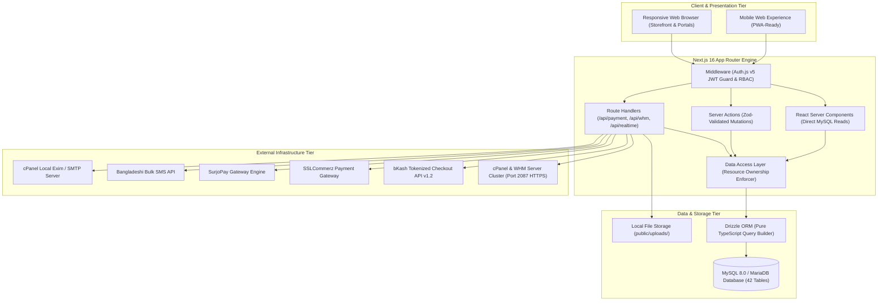
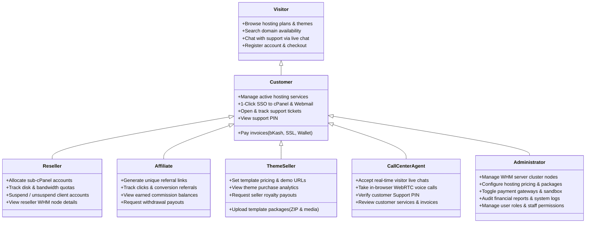
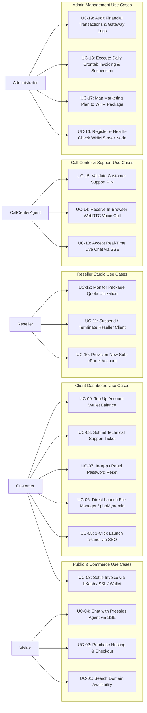
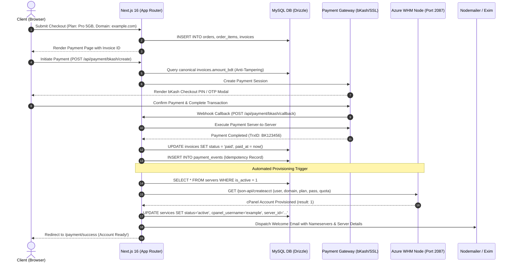
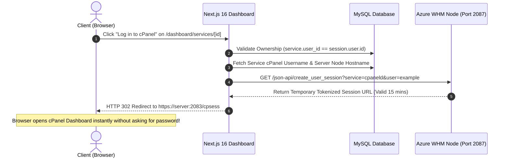
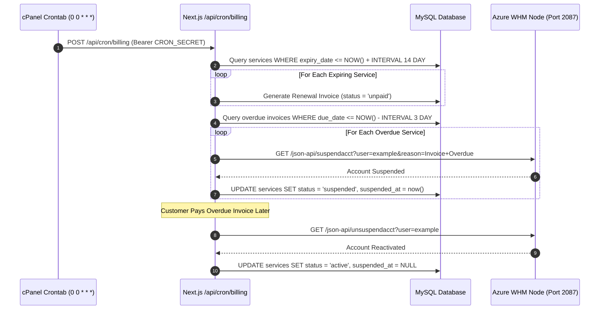

# Software Requirements Specification (SRS)
## Next.js (App Router) + MySQL Full-Stack Architecture with Automated cPanel & WHM Provisioning

**Project Name:** Yess Host Web Hosting & Cloud Management Platform  
**Target Environments:** Local Development (XAMPP MySQL `127.0.0.1:3306`) & Production cPanel Cloud Hosting  
**Architecture Release:** v2.0.0 (Full-Stack Next.js 16 App Router & Drizzle ORM)  
**Document Status:** Approved Technical Specification  
**Date:** September 18, 2026  

---

## 1. Introduction & System Overview

### 1.1 Purpose
This Software Requirements Specification (SRS) establishes the complete functional, non-functional, data, and architectural requirements for the full-stack refactoring of the **Yess Host** platform. The system is an all-in-one cloud hosting, domain registration, cPanel reseller management, theme marketplace, and omnichannel customer support platform tailored for local Bangladeshi payment ecosystems (bKash, SSLCommerz, SurjoPay, and Account Wallet) and global cPanel/WHM server clusters.

### 1.2 Scope & System Vision
Yess Host bridges consumer e-commerce with automated Linux hosting infrastructure:
1. **Self-Service Client Portal:** Real-time domain registration/lookup, hosting tier selection, automated billing settlement, and **1-Click Single Sign-On (SSO)** into provisioned cPanel accounts without typing passwords.
2. **Infrastructure Orchestration:** Automated execution of cPanel & WHM API 1 functions (`createacct`, `suspendacct`, `unsuspendacct`, `create_user_session`, `changepackage`, `passwd`) across multi-datacenter server nodes (including live verified nodes like Azure AlmaLinux 9 `yesshost-cpanel.eastasia.cloudapp.azure.com`).
3. **Reseller Business Studio:** Hierarchical quota allocation allowing cPanel resellers to provision and manage sub-accounts with white-label nameservers and strict server-side resource enforcement.
4. **Omnichannel Call Center:** WebRTC in-browser softphone calling, real-time visitor live chat powered by Native Server-Sent Events (SSE), and customer Support PIN identity verification.
5. **Multi-Role Administrative Back-Office:** Real-time WHM server cluster health monitoring, manual and automated invoice approvals, payment gateway switches, and security audits.

### 1.3 Target Operating Environments
* **Local Development Environment:**
  * Node.js v24.18.0+, npm v11.16.0+
  * XAMPP for Linux (v8.2.12+) running MySQL 8.0/MariaDB 10.4 on `127.0.0.1:3306` with database `yesshost`
  * Drizzle ORM with pure TypeScript `mysql2/promise` connection pooling
* **Production Deployment Environment:**
  * Standard **cPanel Cloud Hosting** running CloudLinux / AlmaLinux
  * cPanel "Setup Node.js App" (Phusion Passenger / Node.js Selector) utilizing Next.js `output: "standalone"`
  * cPanel managed MySQL database (`localhost:3306`)
  * Direct execution of cron tasks via cPanel crontab invoking `/api/cron/billing`

### 1.4 High-Level System Architecture Diagram

---

## 2. User Actors & Personas

The platform defines seven primary user actors with distinct access permissions, operational workflows, and system goals:

### 2.1 Actor Matrix
1. **Unauthenticated Visitor (ACT-VIS):** Prospective customers browsing hosting tiers, searching for domains, viewing theme demos, and initiating presales live chats.
2. **Web Hosting Customer (ACT-CUS):** Registered users who purchase hosting, manage active cPanel environments via 1-click SSO, pay invoices, renew domains, and submit technical tickets.
3. **cPanel Reseller (ACT-RES):** Advanced clients holding reseller packages who partition bulk server resources to create and sell sub-accounts to their own end-clients.
4. **Affiliate Partner (ACT-AFF):** Marketing partners sharing affiliate tracking links to earn recurring commissions on referred customer purchases.
5. **Theme Developer / Seller (ACT-THM):** Digital designers submitting website templates to the Yess Host Theme Marketplace to earn author royalties.
6. **Call Center Operator (ACT-CCA):** Customer support representatives handling live inquiries, voice softphone calls, and verifying customer identity via unique 6-digit Support PINs.
7. **System Administrator / Owner (ACT-ADM):** Platform operators managing the WHM server nodes, reviewing financial settlements, configuring gateway credentials, and executing system-wide policies.

---

## 3. System Use Cases & Use Case Catalog

---

## 4. Functional Requirements Specification (FRS)

### 4.1 Module 1: Authentication & Access Control (IAM)
* **REQ-IAM-01 (Auth.js v5 Architecture):** The system shall manage user sessions using Auth.js (NextAuth v5) integrated with `@auth/drizzle-adapter` on MySQL with HTTP-only, secure, SameSite cookies.
* **REQ-IAM-02 (Password Hashing):** All passwords shall be hashed using `bcryptjs` with a minimum cost factor of 12 before database insertion.
* **REQ-IAM-03 (Role-Based Access Control):** The system shall enforce 5 hierarchical user roles: `user`, `reseller`, `call_center`, `moderator`, and `admin`. Next.js Middleware (`src/middleware.ts`) shall protect `/dashboard/*`, `/admin/*`, and `/call-center/*` routes.
* **REQ-IAM-04 (Support PIN Generator):** Every user profile shall have a unique, persistent 6-digit numeric Support PIN generated at registration for telephone and chat identity verification.
* **REQ-IAM-05 (Data Access Layer - DAL):** All database queries for user resources (invoices, services, tickets) shall enforce ownership validation (`WHERE user_id = session.user.id`) at the application layer, completely replacing Supabase Postgres RLS.

### 4.2 Module 2: WHM & cPanel Server Automation
* **REQ-WHM-01 (Multi-Server Cluster Management):** The system shall support multiple WHM server nodes recorded in the `servers` table (e.g. Azure AlmaLinux 9 Node `yesshost-cpanel.eastasia.cloudapp.azure.com`).
* **REQ-WHM-02 (Automated Retail Provisioning Hook):** Upon successful payment of an invoice containing a hosting service, the system shall automatically execute WHM API 1 `GET /json-api/createacct?api.version=1` on port 2087 of the assigned server node.
* **REQ-WHM-03 (cPanel Username Generation):** cPanel usernames shall be generated using the first 8 alphanumeric characters of the domain name (converted to lowercase, ensuring uniqueness and starting with a letter).
* **REQ-WHM-04 (1-Click Single Sign-On - SSO):** The client dashboard shall provide a 1-click **"Log in to cPanel"** button that invokes WHM API 1 `GET /json-api/create_user_session?api.version=1&service=cpaneld&user=<username>`, redirecting the client via a 15-minute temporary tokenized session URL without requiring password entry.
* **REQ-WHM-05 (Direct Application Shortcuts):** The dashboard shall provide direct launch shortcuts for **File Manager** (`app=FileManager_Home`), **phpMyAdmin** (`app=Database_phpMyAdmin`), and **Webmail** (`service=webmaild`) utilizing `create_user_session`.
* **REQ-WHM-06 (Automated Suspension Hook):** When an invoice remains unpaid past the grace period, the system shall call WHM API 1 `GET /json-api/suspendacct?user=<username>&reason=<reason>`.
* **REQ-WHM-07 (Automated Un-suspension Hook):** The instant an overdue invoice is settled, the system shall automatically call WHM API 1 `GET /json-api/unsuspendacct?user=<username>`.
* **REQ-WHM-08 (In-Dashboard Password Reset):** Customers shall be able to reset their live cPanel password directly from `/dashboard/services/[id]` by invoking WHM API 1 `GET /json-api/passwd`.
* **REQ-WHM-09 (Reseller Ownership Isolation):** When a reseller creates a sub-account, the system shall pass `owner=<reseller_whm_username>` to `createacct`, correctly attributing server-side quotas to the reseller.

### 4.3 Module 3: Commerce, Billing & Payment Gateways
* **REQ-PAY-01 (Anti-Tampering Pricing Rule):** All payment initialization endpoints (`/api/payment/bkash/create`, `/api/payment/sslcommerz/init`, etc.) shall strictly fetch the payable amount from `invoices.amount_bdt` in MySQL. Any client-supplied amount in the request payload shall be discarded.
* **REQ-PAY-02 (Safe UUID Delimiter for SSLCommerz):** Transaction IDs shall be structured using underscores (`TXN_${invoice_id}_${Date.now()}`) so that RFC 4122 hyphenated UUIDs are preserved during callback parsing without truncation.
* **REQ-PAY-03 (bKash Payment Verification):** The bKash callback handler shall execute bKash Tokenized Checkout `/execute` server-to-server and map the canonical invoice UUID directly to settle invoices.
* **REQ-PAY-04 (ACID Wallet Concurrency):** Account wallet deductions shall execute inside a strict MySQL transaction holding an exclusive row-level lock (`SELECT ... FROM wallet_transactions WHERE user_id = ? FOR UPDATE`) to prevent double-spend race conditions.
* **REQ-PAY-05 (Idempotent Webhook Processing):** The `payment_events` table shall enforce a unique composite constraint on `(gateway, transaction_id)` to prevent duplicate settlement from webhook retries.
* **REQ-PAY-06 (Daily Crontab Billing Engine):** A scheduled task executed via cPanel crontab (`/api/cron/billing`, protected by `CRON_SECRET`) shall:
  * Generate recurring renewal invoices 14 days prior to `services.expiry_date`.
  * Auto-suspend cPanel accounts via WHM when invoices are 3+ days overdue.
  * Dispatch email and SMS overdue notices.

### 4.4 Module 4: Omnichannel Call Center & Support
* **REQ-SUP-01 (Native SSE Live Chat):** Visitor-to-agent live chat shall use Next.js native Server-Sent Events (`/api/realtime/stream`) with zero external WebSocket dependencies, operating reliably behind Apache/LiteSpeed reverse proxies.
* **REQ-SUP-02 (WebRTC Softphone Calling):** Call Center agents shall be able to accept incoming voice calls directly in the browser via WebRTC audio streams linked to `call_history`.
* **REQ-SUP-03 (Support PIN Verification):** The Call Center portal shall feature an instant PIN lookup widget to confirm customer identity before revealing server credentials or modifying services.
* **REQ-SUP-04 (Support Ticket Threading):** Customers and staff shall be able to create, reply to, and close support tickets with file attachments and severity levels (`low`, `medium`, `high`, `urgent`).

### 4.5 Module 5: Themes Marketplace & Affiliate Engine
* **REQ-THM-01 (Theme Author Studio):** Designers shall be able to upload ZIP files, preview links, screenshots, and pricing for website templates.
* **REQ-THM-02 (Admin Moderation & Royalties):** Theme submissions shall require admin approval (`approval_status = 'approved'`), and seller commission rates shall be set by admin policy to prevent unauthorized 100% payouts.
* **REQ-AFF-01 (Affiliate Referral Attribution):** Visitors arriving with `?ref=CODE` shall have a 30-day tracking cookie stored; upon customer registration, referral lineage shall be bound in `affiliate_referrals`.
* **REQ-AFF-02 (Automated Commission Accrual):** When a referred client pays an invoice, the affiliate shall automatically receive a configured percentage credit in `affiliate_commissions`.

---

## 5. Non-Functional Requirements (NFR)

### 5.1 Performance & Scalability
* **NFR-PERF-01 (Server-Side Rendering Latency):** Public storefront pages (Home, Pricing, Knowledge Base) shall achieve a Time to First Byte (TTFB) under 250ms on cPanel Cloud Hosting.
* **NFR-PERF-02 (Database Connection Pooling):** The `mysql2` connection pool shall be configured with `connectionLimit: 10`, `waitForConnections: true`, and `queueLimit: 0` to prevent socket starvation under shared cPanel CloudLinux environments.
* **NFR-PERF-03 (Optimized Standalone Bundle):** Next.js `output: 'standalone'` shall bundle all server dependencies into `.next/standalone`, keeping deployment memory footprints under 150MB of RAM.

### 5.2 Security & Financial Integrity
* **NFR-SEC-01 (Secret Isolation):** Root WHM API tokens and payment gateway private keys shall reside exclusively in server-side `.env` files and never be prefixed with `NEXT_PUBLIC_` or bundled into client JavaScript.
* **NFR-SEC-02 (CORS & Port 2087 Protection):** Direct client browser calls to WHM port 2087 are strictly prohibited. All WHM communication shall occur via server-to-server HTTPS agents in `src/lib/whm/`.
* **NFR-SEC-03 (Input Sanitization):** All form inputs and API payloads shall be validated with `zod` schemas to prevent SQL injection, XSS, and command injection attacks.

### 5.3 Reliability & Availability
* **NFR-REL-01 (Graceful WHM Degradation):** In the event of a temporary WHM server network failure during checkout, the order status shall be marked as `provisioning_failed`, the invoice settlement shall remain intact, and an automated alert shall notify administrators for 1-click retry.
* **NFR-REL-02 (Database Transaction Rollbacks):** Any failure during composite checkout operations (deducting wallet balance + creating service + generating invoice) shall trigger an automatic database rollback.

---

## 6. Complete Entity-Relationship Diagram (ERD) & Database Schema (42 Tables)

The database consists of **42 relational tables** managed by Drizzle ORM and optimized for MySQL 8.0 / MariaDB:

```mermaid
erDiagram
    %% IAM & Authentication Module
    users ||--o| profiles : "has profile"
    users ||--o{ accounts : "has oauth"
    users ||--o{ sessions : "has sessions"
    users ||--o{ user_roles : "assigned role"
    users ||--o{ user_permissions : "granted perm"
    users ||--o{ notifications : "receives"

    %% Server Infrastructure Module
    servers ||--o{ services : "hosts"
    services ||--o| reseller_packages : "provisions"
    reseller_packages ||--o{ reseller_accounts : "allocates"
    users ||--o{ services : "owns"

    %% Commerce & Billing Module
    pricing_plans ||--o{ services : "defines plan"
    orders ||--o{ order_items : "contains"
    orders ||--o| invoices : "generates"
    users ||--o{ orders : "places"
    users ||--o{ invoices : "billed to"
    services ||--o{ invoices : "billed via"
    invoices ||--o{ payment_events : "logged in"
    users ||--o{ wallet_transactions : "owns"
    coupons ||--o{ orders : "applied to"

    %% Support & Omnichannel Module
    users ||--o{ support_tickets : "submits"
    services ||--o{ support_tickets : "subject of"
    support_tickets ||--o{ ticket_replies : "contains"
    users ||--o{ live_chats : "participates"
    live_chats ||--o{ live_chat_messages : "contains"
    live_chats ||--o{ call_history : "logs"
    chat_rooms ||--o{ chat_room_members : "members"
    chat_rooms ||--o{ chat_room_messages : "messages"

    %% Affiliate & Marketing Module
    users ||--o| affiliate_profiles : "enrolled as"
    affiliate_profiles ||--o{ affiliate_referrals : "tracks"
    affiliate_profiles ||--o{ affiliate_clicks : "records"
    affiliate_referrals ||--o{ affiliate_commissions : "earns"
    invoices ||--o{ affiliate_commissions : "generates"
    affiliate_profiles ||--o{ affiliate_payouts : "claims"

    %% Themes Marketplace Module
    users ||--o{ themes : "authors"
    themes ||--o{ theme_orders : "purchased in"
    users ||--o{ theme_orders : "buys"
    users ||--o{ theme_seller_payouts : "requests"

    %% Knowledge Base & Content Module
    kb_categories ||--o{ kb_articles : "categorizes"

    %% Entities Definitions with Attributes
    servers {
        varchar_36 id PK
        varchar_255 name
        varchar_255 hostname
        varchar_45 ip_address
        varchar_64 whm_username
        text whm_api_token
        varchar_100 location
        int max_accounts
        int active_accounts
        tinyint_1 is_active
    }
    services {
        varchar_36 id PK
        varchar_36 user_id FK
        varchar_36 server_id FK
        varchar_255 domain
        varchar_64 cpanel_username
        varchar_100 package_name
        varchar_50 service_type
        varchar_20 billing_cycle
        varchar_20 status
        decimal_10_2 price_bdt
        datetime start_date
        datetime expiry_date
    }
    reseller_packages {
        varchar_36 id PK
        varchar_36 user_id FK
        varchar_36 service_id FK
        varchar_100 package_name
        int max_accounts
        int used_accounts
        int max_disk_mb
        int used_disk_mb
    }
    reseller_accounts {
        varchar_36 id PK
        varchar_36 reseller_package_id FK
        varchar_255 domain
        varchar_64 cpanel_username
        varchar_20 status
    }
    invoices {
        varchar_36 id PK
        varchar_36 user_id FK
        varchar_36 service_id FK
        varchar_50 invoice_number UK
        decimal_10_2 amount_bdt
        varchar_20 status
        datetime due_date
        datetime paid_at
    }
    orders {
        varchar_36 id PK
        varchar_50 order_number UK
        varchar_36 user_id FK
        varchar_36 invoice_id FK
        decimal_10_2 total_bdt
        varchar_20 status
    }
    pricing_plans {
        varchar_36 id PK
        varchar_100 name
        varchar_50 slug UK
        varchar_100 whm_package_name
        decimal_10_2 price_bdt
        decimal_10_2 annual_price_bdt
    }
    support_tickets {
        varchar_36 id PK
        varchar_36 user_id FK
        varchar_36 service_id FK
        varchar_50 ticket_number UK
        varchar_255 subject
        varchar_20 status
        varchar_20 priority
    }
    live_chats {
        varchar_36 id PK
        varchar_36 user_id FK
        varchar_100 visitor_name
        varchar_20 status
    }
    affiliate_profiles {
        varchar_36 id PK
        varchar_36 user_id FK
        varchar_50 referral_code UK
        decimal_10_2 balance_bdt
    }
    themes {
        varchar_36 id PK
        varchar_36 seller_user_id FK
        varchar_255 name
        varchar_100 slug UK
        decimal_10_2 price_bdt
        varchar_20 approval_status
    }
```

---

### 6.1 Exhaustive Specifications of the 42 Database Tables

#### Group A: Identity & Access Management (Tables 1–7)
1. **`users` (Auth.js core table):** `id` (VARCHAR 36, PK), `name` (VARCHAR 255), `email` (VARCHAR 255, UK), `emailVerified` (DATETIME), `image` (TEXT), `password_hash` (VARCHAR 255), `created_at` (DATETIME), `updated_at` (DATETIME).
2. **`accounts` (Auth.js OAuth):** `id` (VARCHAR 36, PK), `userId` (VARCHAR 36, FK -> users.id), `type` (VARCHAR 255), `provider` (VARCHAR 255), `providerAccountId` (VARCHAR 255), `refresh_token` (TEXT), `access_token` (TEXT), `expires_at` (INT), `token_type` (VARCHAR 255), `scope` (TEXT), `id_token` (TEXT), `session_state` (TEXT).
3. **`sessions` (Auth.js session tokens):** `id` (VARCHAR 36, PK), `sessionToken` (VARCHAR 255, UK), `userId` (VARCHAR 36, FK -> users.id), `expires` (DATETIME).
4. **`verification_tokens`:** `identifier` (VARCHAR 255), `token` (VARCHAR 255, UK), `expires` (DATETIME).
5. **`profiles` (Customer identity):** `id` (VARCHAR 36, PK), `user_id` (VARCHAR 36, FK -> users.id, UK), `full_name` (VARCHAR 255), `phone` (VARCHAR 30), `address` (TEXT), `city` (VARCHAR 100), `country` (VARCHAR 100 DEFAULT 'Bangladesh'), `company_name` (VARCHAR 255), `support_pin` (VARCHAR 6), `created_at` (DATETIME).
6. **`user_roles` (RBAC assignment):** `id` (VARCHAR 36, PK), `user_id` (VARCHAR 36, FK -> users.id), `role` (ENUM: 'admin', 'moderator', 'call_center', 'reseller', 'user'), `created_at` (DATETIME). Unique on `(user_id, role)`.
7. **`user_permissions` (Granular staff permissions):** `id` (VARCHAR 36, PK), `user_id` (VARCHAR 36, FK -> users.id), `permission` (VARCHAR 100), `created_at` (DATETIME).

#### Group B: Server Infrastructure & Hosting (Tables 8–11)
8. **`servers` (WHM cluster nodes):** `id` (VARCHAR 36, PK), `name` (VARCHAR 255), `hostname` (VARCHAR 255), `ip_address` (VARCHAR 45), `whm_username` (VARCHAR 64), `whm_api_token` (TEXT), `location` (VARCHAR 100), `max_accounts` (INT DEFAULT 500), `active_accounts` (INT DEFAULT 0), `is_active` (TINYINT 1 DEFAULT 1), `created_at` (DATETIME).
9. **`services` (Hosting accounts & domains):** `id` (VARCHAR 36, PK), `user_id` (VARCHAR 36, FK -> users.id), `server_id` (VARCHAR 36, FK -> servers.id), `name` (VARCHAR 255), `domain` (VARCHAR 255), `cpanel_username` (VARCHAR 64), `package_name` (VARCHAR 100), `service_type` (VARCHAR 50), `billing_cycle` (VARCHAR 20), `price_bdt` (DECIMAL 10,2), `status` (VARCHAR 20), `start_date` (DATETIME), `expiry_date` (DATETIME), `suspended_at` (DATETIME), `suspension_reason` (TEXT), `specs` (JSON), `created_at` (DATETIME).
10. **`reseller_packages` (Reseller quota tracking):** `id` (VARCHAR 36, PK), `user_id` (VARCHAR 36, FK -> users.id), `service_id` (VARCHAR 36, FK -> services.id), `package_name` (VARCHAR 100), `max_accounts` (INT), `used_accounts` (INT DEFAULT 0), `max_disk_mb` (INT), `used_disk_mb` (INT DEFAULT 0), `max_bandwidth_mb` (INT), `used_bandwidth_mb` (INT DEFAULT 0), `whm_username` (VARCHAR 64), `status` (VARCHAR 20), `created_at` (DATETIME).
11. **`reseller_accounts` (Sub-cPanel accounts):** `id` (VARCHAR 36, PK), `reseller_package_id` (VARCHAR 36, FK -> reseller_packages.id), `reseller_user_id` (VARCHAR 36, FK -> users.id), `domain` (VARCHAR 255), `username` (VARCHAR 64), `plan_name` (VARCHAR 100), `disk_quota_mb` (INT), `bandwidth_mb` (INT), `cpanel_created` (TINYINT 1), `status` (VARCHAR 20), `created_at` (DATETIME).

#### Group C: Commerce, Orders & Financial Settlement (Tables 12–20)
12. **`pricing_plans` (Hosting plans catalog):** `id` (VARCHAR 36, PK), `name` (VARCHAR 100), `slug` (VARCHAR 100, UK), `whm_package_name` (VARCHAR 100), `category` (VARCHAR 50), `price_bdt` (DECIMAL 10,2), `annual_price_bdt` (DECIMAL 10,2), `features` (JSON), `is_featured` (TINYINT 1), `is_active` (TINYINT 1), `created_at` (DATETIME).
13. **`domain_pricing` (TLD price list):** `id` (VARCHAR 36, PK), `tld` (VARCHAR 50, UK), `registration_price_bdt` (DECIMAL 10,2), `renewal_price_bdt` (DECIMAL 10,2), `transfer_price_bdt` (DECIMAL 10,2), `min_years` (INT DEFAULT 1), `is_active` (TINYINT 1).
14. **`coupons` (Promo discounts):** `id` (VARCHAR 36, PK), `code` (VARCHAR 50, UK), `discount_type` (VARCHAR 20), `discount_value` (DECIMAL 10,2), `min_spend_bdt` (DECIMAL 10,2), `valid_from` (DATETIME), `valid_until` (DATETIME), `usage_limit` (INT), `times_used` (INT DEFAULT 0), `is_active` (TINYINT 1).
15. **`orders` (Customer checkouts):** `id` (VARCHAR 36, PK), `order_number` (VARCHAR 50, UK), `user_id` (VARCHAR 36, FK -> users.id), `invoice_id` (VARCHAR 36, FK -> invoices.id), `status` (VARCHAR 20), `subtotal_bdt` (DECIMAL 10,2), `discount_bdt` (DECIMAL 10,2), `total_bdt` (DECIMAL 10,2), `coupon_code` (VARCHAR 50), `created_at` (DATETIME).
16. **`order_items` (Order cart line items):** `id` (VARCHAR 36, PK), `order_id` (VARCHAR 36, FK -> orders.id), `item_type` (VARCHAR 50), `item_name` (VARCHAR 255), `domain` (VARCHAR 255), `billing_cycle` (VARCHAR 20), `price_bdt` (DECIMAL 10,2), `provisioning_data` (JSON).
17. **`invoices` (Receivable bills):** `id` (VARCHAR 36, PK), `user_id` (VARCHAR 36, FK -> users.id), `service_id` (VARCHAR 36, FK -> services.id), `invoice_number` (VARCHAR 50, UK), `amount_bdt` (DECIMAL 10,2), `status` (VARCHAR 20 DEFAULT 'unpaid'), `payment_method` (VARCHAR 50), `due_date` (DATETIME), `paid_at` (DATETIME), `description` (TEXT), `created_at` (DATETIME).
18. **`payment_events` (Gateway audit logs):** `id` (VARCHAR 36, PK), `invoice_id` (VARCHAR 36, FK -> invoices.id), `user_id` (VARCHAR 36, FK -> users.id), `gateway` (VARCHAR 50), `transaction_id` (VARCHAR 100), `amount_bdt` (DECIMAL 10,2), `status` (VARCHAR 50), `verified` (TINYINT 1), `payload` (JSON), `created_at` (DATETIME).
19. **`wallet_transactions` (Prepaid balance ledger):** `id` (VARCHAR 36, PK), `user_id` (VARCHAR 36, FK -> users.id), `type` (ENUM: 'deposit', 'withdrawal', 'payment', 'refund'), `amount_bdt` (DECIMAL 10,2), `status` (VARCHAR 20), `payment_method` (VARCHAR 50), `transaction_id` (VARCHAR 100), `description` (TEXT), `created_at` (DATETIME).
20. **`payment_gateway_settings` (Credential configs):** `id` (VARCHAR 36, PK), `gateway` (VARCHAR 50, UK), `enabled` (TINYINT 1), `is_sandbox` (TINYINT 1), `credentials` (JSON), `updated_at` (DATETIME).

#### Group D: Omnichannel Support & Operator Portal (Tables 21–28)
21. **`support_tickets` (Help desk tickets):** `id` (VARCHAR 36, PK), `ticket_number` (VARCHAR 50, UK), `user_id` (VARCHAR 36, FK -> users.id), `service_id` (VARCHAR 36, FK -> services.id), `subject` (VARCHAR 255), `department` (VARCHAR 50), `priority` (VARCHAR 20), `status` (VARCHAR 20 DEFAULT 'open'), `created_at` (DATETIME).
22. **`ticket_replies` (Ticket responses):** `id` (VARCHAR 36, PK), `ticket_id` (VARCHAR 36, FK -> support_tickets.id), `user_id` (VARCHAR 36, FK -> users.id), `message` (TEXT), `attachments` (JSON), `is_staff` (TINYINT 1), `created_at` (DATETIME).
23. **`live_chats` (SSE chat conversations):** `id` (VARCHAR 36, PK), `user_id` (VARCHAR 36, FK -> users.id, nullable), `visitor_name` (VARCHAR 100), `visitor_email` (VARCHAR 255), `visitor_phone` (VARCHAR 50), `status` (VARCHAR 20 DEFAULT 'open'), `created_at` (DATETIME).
24. **`live_chat_messages` (Real-time messages):** `id` (VARCHAR 36, PK), `chat_id` (VARCHAR 36, FK -> live_chats.id), `sender_type` (VARCHAR 20), `message` (TEXT), `created_at` (DATETIME).
25. **`call_history` (WebRTC voice logs):** `id` (VARCHAR 36, PK), `chat_id` (VARCHAR 36, FK -> live_chats.id), `call_type` (VARCHAR 20), `duration_seconds` (INT DEFAULT 0), `status` (VARCHAR 20), `created_at` (DATETIME).
26. **`chat_rooms` (Internal staff collaboration):** `id` (VARCHAR 36, PK), `name` (VARCHAR 100), `description` (TEXT), `is_active` (TINYINT 1), `created_at` (DATETIME).
27. **`chat_room_members`:** `id` (VARCHAR 36, PK), `room_id` (VARCHAR 36, FK -> chat_rooms.id), `user_id` (VARCHAR 36, FK -> users.id), `joined_at` (DATETIME).
28. **`chat_room_messages`:** `id` (VARCHAR 36, PK), `room_id` (VARCHAR 36, FK -> chat_rooms.id), `user_id` (VARCHAR 36, FK -> users.id), `message` (TEXT), `created_at` (DATETIME).

#### Group E: Affiliate & Partner Engine (Tables 29–33)
29. **`affiliate_profiles` (Affiliate registration):** `id` (VARCHAR 36, PK), `user_id` (VARCHAR 36, FK -> users.id, UK), `referral_code` (VARCHAR 50, UK), `balance_bdt` (DECIMAL 10,2 DEFAULT 0), `total_earned_bdt` (DECIMAL 10,2 DEFAULT 0), `status` (VARCHAR 20), `created_at` (DATETIME).
30. **`affiliate_clicks` (Tracking hits):** `id` (VARCHAR 36, PK), `referrer_user_id` (VARCHAR 36, FK -> users.id), `ip_address` (VARCHAR 45), `user_agent` (TEXT), `created_at` (DATETIME).
31. **`affiliate_referrals` (Bound referred customers):** `id` (VARCHAR 36, PK), `referrer_user_id` (VARCHAR 36, FK -> users.id), `referred_user_id` (VARCHAR 36, FK -> users.id, UK), `status` (VARCHAR 20), `created_at` (DATETIME).
32. **`affiliate_commissions` (Commission earnings):** `id` (VARCHAR 36, PK), `referral_id` (VARCHAR 36, FK -> affiliate_referrals.id), `invoice_id` (VARCHAR 36, FK -> invoices.id), `user_id` (VARCHAR 36, FK -> users.id), `commission_amount_bdt` (DECIMAL 10,2), `status` (VARCHAR 20), `created_at` (DATETIME).
33. **`affiliate_payouts` (Withdrawals):** `id` (VARCHAR 36, PK), `user_id` (VARCHAR 36, FK -> users.id), `amount_bdt` (DECIMAL 10,2), `method` (VARCHAR 50), `account_details` (TEXT), `status` (VARCHAR 20 DEFAULT 'pending'), `processed_at` (DATETIME), `created_at` (DATETIME).

#### Group F: Theme Marketplace (Tables 34–36)
34. **`themes` (Website templates):** `id` (VARCHAR 36, PK), `seller_user_id` (VARCHAR 36, FK -> users.id), `name` (VARCHAR 255), `slug` (VARCHAR 100, UK), `category` (VARCHAR 50), `price_bdt` (DECIMAL 10,2), `preview_url` (TEXT), `file_path` (TEXT), `screenshots` (JSON), `approval_status` (VARCHAR 20 DEFAULT 'pending'), `commission_rate` (DECIMAL 5,2 DEFAULT 30), `is_active` (TINYINT 1 DEFAULT 0), `created_at` (DATETIME).
35. **`theme_orders` (Template sales):** `id` (VARCHAR 36, PK), `user_id` (VARCHAR 36, FK -> users.id), `theme_id` (VARCHAR 36, FK -> themes.id), `amount_bdt` (DECIMAL 10,2), `status` (VARCHAR 20), `payment_method` (VARCHAR 50), `created_at` (DATETIME).
36. **`theme_seller_payouts` (Designer payouts):** `id` (VARCHAR 36, PK), `user_id` (VARCHAR 36, FK -> users.id), `amount_bdt` (DECIMAL 10,2), `method` (VARCHAR 50), `account_details` (TEXT), `status` (VARCHAR 20 DEFAULT 'requested'), `created_at` (DATETIME).

#### Group G: Platform Content, Notifications & Communications (Tables 37–42)
37. **`kb_categories`:** `id` (VARCHAR 36, PK), `name` (VARCHAR 100), `slug` (VARCHAR 100, UK), `icon` (VARCHAR 50), `sort_order` (INT DEFAULT 0).
38. **`kb_articles`:** `id` (VARCHAR 36, PK), `category_id` (VARCHAR 36, FK -> kb_categories.id), `title` (VARCHAR 255), `slug` (VARCHAR 100, UK), `content_bn` (TEXT), `content_en` (TEXT), `views` (INT DEFAULT 0), `created_at` (DATETIME).
39. **`faqs`:** `id` (VARCHAR 36, PK), `question_en` (TEXT), `question_bn` (TEXT), `answer_en` (TEXT), `answer_bn` (TEXT), `category` (VARCHAR 50), `sort_order` (INT DEFAULT 0).
40. **`testimonials`:** `id` (VARCHAR 36, PK), `client_name` (VARCHAR 100), `company` (VARCHAR 100), `rating` (INT DEFAULT 5), `comment` (TEXT), `avatar_url` (TEXT), `is_featured` (TINYINT 1).
41. **`contact_messages`:** `id` (VARCHAR 36, PK), `name` (VARCHAR 100), `email` (VARCHAR 255), `phone` (VARCHAR 50), `subject` (VARCHAR 255), `message` (TEXT), `status` (VARCHAR 20 DEFAULT 'unread'), `created_at` (DATETIME).
42. **`notifications`:** `id` (VARCHAR 36, PK), `user_id` (VARCHAR 36, FK -> users.id), `title` (VARCHAR 255), `message` (TEXT), `type` (VARCHAR 50), `link` (TEXT), `is_read` (TINYINT 1 DEFAULT 0), `created_at` (DATETIME).

---

## 7. End-to-End User Flows & Sequence Diagrams

### 7.1 Flow 1: Hosting Checkout, Payment & Automated WHM Provisioning

### 7.2 Flow 2: 1-Click cPanel Single Sign-On (SSO)

### 7.3 Flow 3: Daily Crontab Invoicing, Auto-Suspension & Late Reactivation

---

## 8. Comprehensive User Stories & Acceptance Criteria

### Persona 1: Web Hosting Customer
* **US-CUS-01 (Automated Provisioning):**
  * *As a web hosting buyer,* I want my cPanel hosting space created automatically the second my bKash or card payment succeeds *so that* I can upload my website immediately without waiting for office hours.
  * **Acceptance Criteria:**
    * Given an unpaid invoice for a hosting plan, when payment is confirmed via gateway callback, then a live cPanel account must exist on the Azure server within 10 seconds.
    * Given an active service, the customer must receive an email containing domain, cPanel username, server IP, and nameservers.
* **US-CUS-02 (1-Click cPanel SSO):**
  * *As a hosting customer,* I want to click "Log in to cPanel" inside my dashboard and be logged in directly *so that* I don't have to search for passwords or visit port 2083 manually.
  * **Acceptance Criteria:**
    * Given a logged-in user viewing their active service, clicking "Log in to cPanel" must invoke `create_user_session` and redirect to the authenticated cPanel session.
    * Unauthorized users attempting to request SSO for another user's service must receive a 403 Forbidden error.

### Persona 2: cPanel Reseller
* **US-RES-01 (Sub-Account Allocation):**
  * *As a reseller,* I want to create cPanel accounts for my clients with custom disk and bandwidth limits *so that* I can run my own hosting brand.
  * **Acceptance Criteria:**
    * Given an active reseller package with 25 account limits, when creating the 26th account, the system must reject creation with "Quota Exceeded".
    * When an account is created, `createacct` must execute with `owner=<reseller_username>` so it nests under the reseller's WHM view.

### Persona 3: System Administrator
* **US-ADM-01 (Server Node Clustering):**
  * *As a system administrator,* I want to register and monitor multiple WHM servers with individual API tokens *so that* accounts are distributed across reliable datacenters.
  * **Acceptance Criteria:**
    * Admin can add a server with hostname, IP, and token.
    * Admin can click "Test Connection" to execute WHM `version` and view server health in real time.
* **US-ADM-02 (Anti-Tampering Financial Control):**
  * *As a platform owner,* I want the payment gateways to strictly verify payable amounts on the server *so that* attackers cannot tamper with prices in browser dev tools.
  * **Acceptance Criteria:**
    * When a client sends a modified `amount` field to any payment API, the backend ignores it and charges the true database value.

---

## 9. Traceability & Implementation Sign-Off

This document serves as the formal functional and technical blueprint governing the execution of **Phases 0 through 9** of the Next.js + MySQL Refactoring Plan. All database schema tables, API route contracts, and WHM client methods defined herein shall be implemented with strict adherence to the specifications detailed above.
