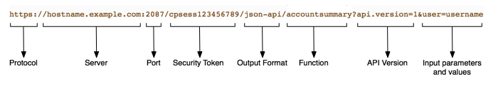
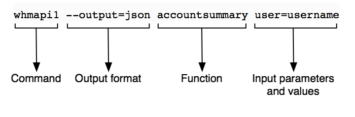

# Introduction to WHM API 1

## Overview

WHM API 1 accesses the WHM interface's features. You can use this API to perform server administration tasks, administrate cPanel and WHM reseller accounts, and manage cPanel & WHM services.

> **Note**
* When you enable a non-Standard Node [server profile](https://go.cpanel.net/serverroles), the system disables API calls associated with that profile's disabled roles.
* Use the [`applist`](/openapi/whm/operation/applist/) command to return an alphabetical list of WHM API 1 functions.
* You **cannot** call this API's functions via another API's call methods.


## Basic usage

### JSON API


```bash
https://hostname.example.com:2087/cpsess##########/json-api/accountsummary?api.version=1&user=username
```

WHM API 1 calls through JSON consist of the following basic parts:



#### Server and port

The web server's HTTP address and the port number to use. Generally, this value begins with `https://` and the domain name.

When you call this API, use the following ports:

* `2086` - Unsecure calls as a specific WHM account.
* `2087` - Secure calls as a specific WHM account.


> **Warning**
You **cannot** call this API via cPanel ports (`2082` or `2083`) or Webmail ports (`2095` or `2096`).


#### Security token

The current session's [security token](https://go.cpanel.net/basic-security-concepts).

> **Note**
Cookie-based calls (for example, calls from a web browser) require a security token. For other authentication methods, read our Guide to API Authentication documentation.


#### API type

The API output type that you wish to receive. Use `json-api` to return JSON-formatted output.

#### Function

The WHM API function.

#### API version

The API version to use. To call WHM API 1, set the `api.version` parameter to `1`.

> **Important**
You **must** include the API version in your call.


#### Input parameters and values

The function's input parameters and their values.

* You **must** [URI-encode](https://go.cpanel.net/percent-encoding) these values.
* Separate multiple `parameter=value` pairs with the ampersand character (`&`).


> **Note**
The term "Boolean" in our documentation refers to parameters that accept values of `1` or `0`. cPanel & WHM's APIs do **not** support the literal values of `true` and `false`.


### Command Line


```bash
whmapi1 accountsummary user=username
```

* WHM API 1 calls via the command line do **not** return the metadata that other methods return if they experience errors that prevent a successful function run. For more information, read our WHM API 1 - Return Data documentation.


WHM API 1 calls through the command line consist of the following basic parts:



#### Command

This value is always `whmapi1` for calls to WHM API 1.

> **Note**
If you run CloudLinux™, you must use the full path of the` whmapi1` command:


```bash
/usr/local/cpanel/bin/whmapi1
```

#### Output Type

The API output type that you wish to receive.

* Use `--output=json` to return JSON-formatted output.
* Use `--output=jsonpretty` to return indented JSON-formatted output.
* Use `--output=yaml` to return YAML-formatted output.


> **Note**
This parameter defaults to `--output=yaml`.


#### Function

The WHM API 1 function.

#### Input parameters and values

The function's input parameters and their values.

* Separate multiple parameter=value pairs with a space character.
* Special characters within a key's value may cause an error. You **must** either escape any special characters within values or surround the value with appropriate quotes. For more information, read Wikipedia's [Escape Characters](https://go.cpanel.net/Escape_character) article. For example, a bash shell command with a JSON-encoded value may appear similar to one of the following:
  * `whmapi1 function key=[\"sslinstall\",\"videotut\"]"`
  * `whmapi1 function key='{"videotut","sslinstall"}'`


> **Note**
The term "Boolean" in our documentation refers to parameters that accept values of `1` or `0`. cPanel & WHM's APIs do **not** support the literal values of `true` and `false`.


For more information about this feature, run the following command:


```bash
whmapi1 --help
```

Do **not** attempt to use cPanel or WHM interface URLs to perform actions in custom code. You **must** call the appropriate API functions in order to perform the actions of cPanel & WHM's interfaces.

For example, do not pass values to `.html` pages, as in the following example:


```bash
https://example.com:2083/cpsess###########/frontend/jupiter/email_accounts/index.html/create#email=test&domain=example.com```

While this **unsupported** method sometimes worked in previous versions of cPanel & WHM, we **strongly** discourage its use and do **not** guarantee that it will work in the future. Instead, the correct method to perform this action is to call the appropriate API function.
```