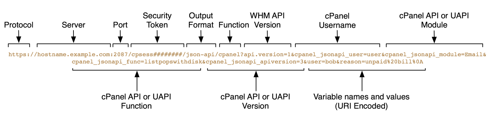

# Use WHM API to call cPanel API 2 and UAPI

## Overview

You can call cPanel API and UAPI functions through the WHM API 1.

**Important:**

We recommend that you use WHM API 1 [`uapi_cpanel`](/openapi/whm/operation/uapi_cpanel/) function. This function is a more flexible way to call cPanel API functions from WHM. For example, you can use the [`uapi_cpanel`](/openapi/whm/operation/uapi_cpanel/) function with the WHM API 1 [`batch`](/openapi/whm/operation/batch/) function.

This method is useful, for example, when you develop plugins for WHM users, particularly resellers, but need to access cPanel functions. You can make these calls from within either the WHM or cPanel interfaces.

For more information about WHM API 1 calls, read our Guide to [WHM API 1](/whm/introduction) documentation.

## Basic usage

WHM API 1 calls consist of the following basic parts:



### `Server`

The web server's HTTP address.

Generally, this value is `https://` and the hostname.

**Example:**


```
https://hostname.example.com
```

### `Port`

The port number to access.

* `2087` - Secure connection.
* `2086` - Insecure connection.


**Note:**

* We strongly recommend that you use port `2087` and a secure connection.
* If you use port `2086` and enable the *Always redirect to SSL* option in WHM's [*Tweak Settings*](https://go.cpanel.net/whmdocsTweakSettings) interface (*WHM >> Home >> Server Configuration >> Tweak Settings*), the system redirects insecure API calls and causes errors.


**Example:**


```
2087
```

### `Security Token`

The current session's security token.

**Example:**


```
cpsess123456789
```

### `Output format`

The output type to return [JavaScript Object Notation (JSON)](https://go.cpanel.net/json). We **only** support the JSON output format.

**Example:**


```
json_api
```

### `Function`

The WHM API 1 function to call. For [cPanel API 2](/cpanel-api-2) and [UAPI](/cpanel/introduction), use the `cpanel` function.

**Example:**


```
cpanel
```

### `cPanel User`

The cPanel username for the account through which to call the function.

Make **certain** that you specify the username in lowercase characters **only**. cPanel & WHM automatically converts usernames to lowercase when you create a cPanel account. For this reason, if you supply a username that includes some or all capital letters, the call will fail.

**Example:**


```
cpanel_jsonapi_user=user
```

### `cPanel API or UAPI Module`

The UAPI module name.

**Important:**

Module names are **case-sensitive**.

**Example:**


```
cpanel_jsonapi_module=Email
```

### `cPanel API or UAPI Function`

The UAPI function name.

**Important:**

Function names are **case-sensitive**.

**Example:**


```
cpanel_jsonapi_func=listpopswithdisk1
```

### `cPanel API Version`

The cPanel API version to use.

* `2` - Use cPanel API 2.
* `3` - Use UAPI.


**Warning:**

If you do not supply this parameter, the system defaults to cPanel API 2.

**Example:**


```
cpanel_jsonapi_apiversion=3
```

### `Variable Names and Values`

The function's input parameters and their values.

**Note:**

* Separate multiple `parameter=value` pairs with the ampersand character (`&`).
* You **must** [URI-encode](https://go.cpanel.net/percent-encoding) these values.


**Example:**


```
domain=example.com
```